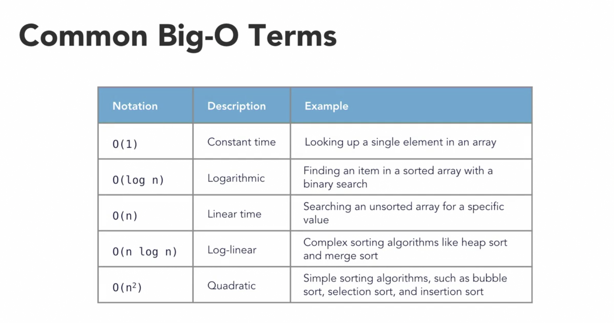
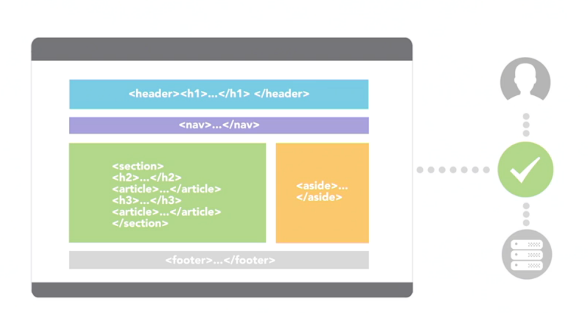
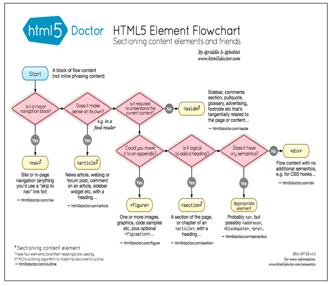
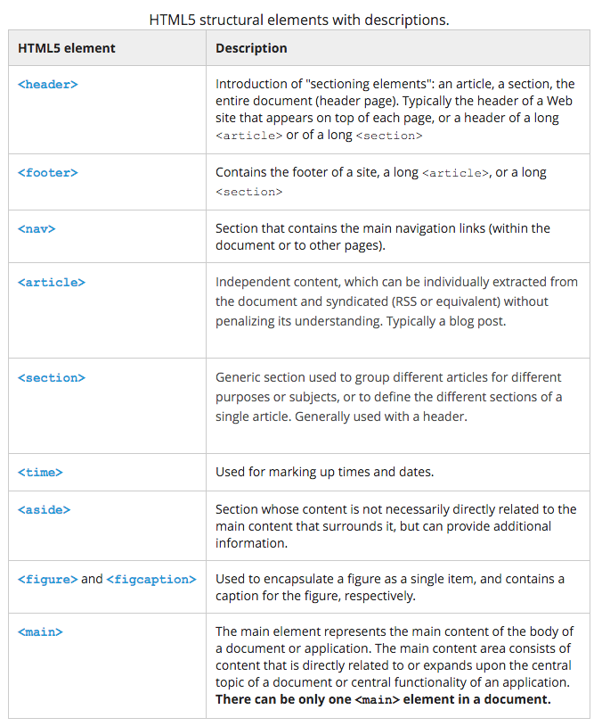
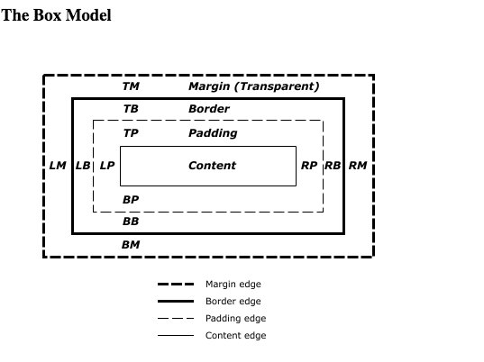
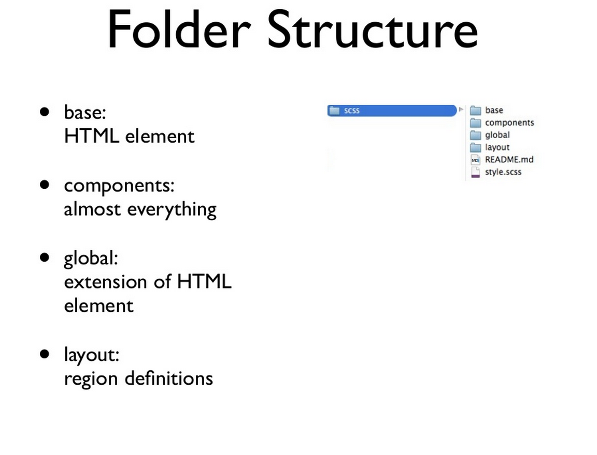
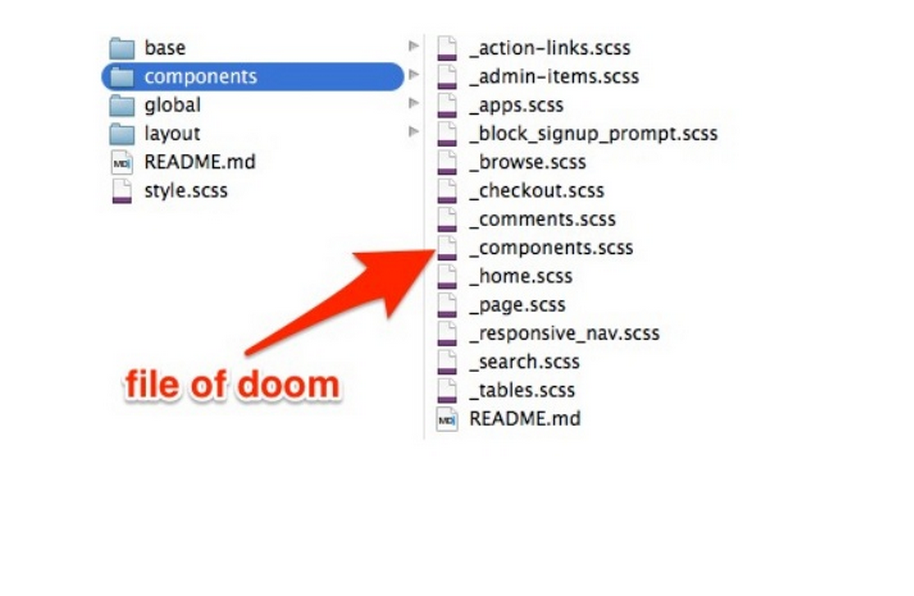
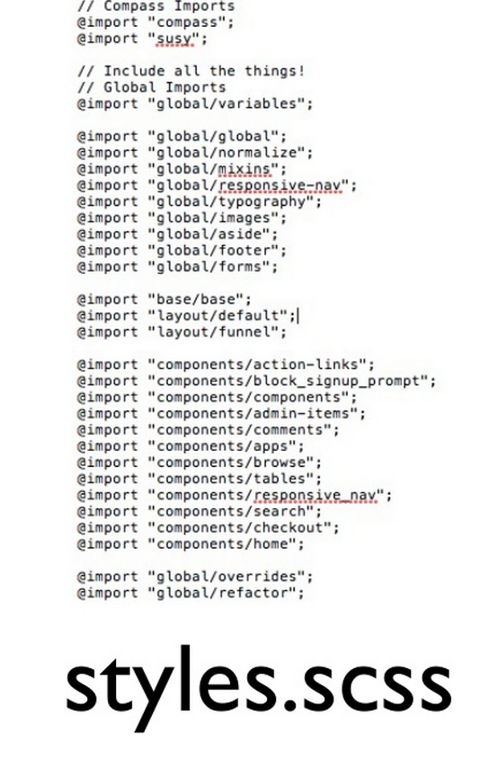
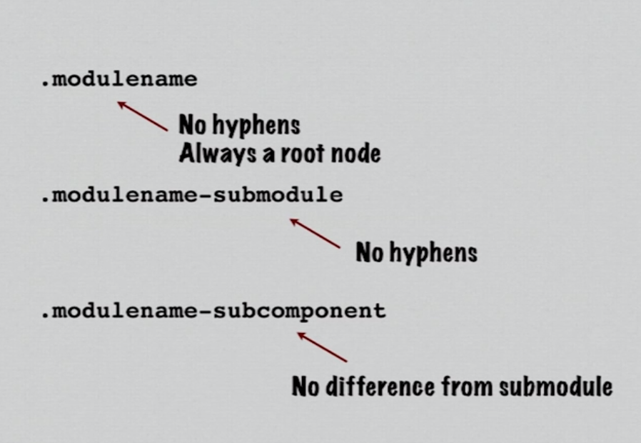

Learning JavaScript (ECMAScript 5 & 6)
=====================

The document contains several notes and snippets from interviews to online sources I found helpful. They are in no particular order ether.

These are my personal notes on the subject and I apologize ahead of time if I didn't give credit or sources.

# Table of Contents
1. [Adding New DOM Elements](#user-content-adding-new-dom-elements)
2. [Anonymous Functions](#user-content-anonymous-functions)
3. [Arrays](#Arrays)
4. [Arrow Functions](#user-content-arrow-functions) 
5. [Async and wait](#user-content-async-and-wait)
6. [Async with fetch](#user-content-async-with-fetch)
7. [Asynchronous functions](#user-content-asynchronous-functions)
8. [Break and Continue](#user-content-break-and-continue)
9. [Building Promises](#user-content-buiding-promises)
10. [Creational Patterns](#user-content-creational-patterns)
  * [Prototype/Class Pattern](#user-content-prototypeclass-pattern)
  * [Constructor Pattern](#user-content-constructor-pattern)
  * [Singleton Pattern](#user-content-singleton-pattern)
  * [Factory Pattern](#user-content-factory-pattern)
  * [Abstract Factory](#user-content-abstract-factory)
11. [Closure](#Closure)
12. [Conditions](#Conditions)
13. [Cheat Sheets](#user-content-cheat-sheets)
14. [DOM Properties](#user-content-dom-properties)
15. [DOM Methods](#user-content-dom-methods)
16. [Destructuring Assignment](#user-content-destructuring-assignment)
17. [Facts](#Facts)
18. [Fetch](#Fetch)
19. [Function factories](#user-content-function-factories)
20. [Functions as first-class citizens](#user-content-functions-as-first-class-citizens)
21. [Generator Functions](#user-content-generator-functions)
22. [Getters and setters](#user-content-getters-and-setters)
23. [Function Hoisting](#user-content-function-hoisting)
24. [Iterables](#Iterables)
25. [Immediately invoked function (iffy)](#user-content-immediately-invoked-function)
26. [Loops](#Loops)
27. [Map](#Map)
28. [Object Constructors](#user-content-object-constructors)
29. [Object Literals](#user-content-object-literals)
30. [Promise](#Promise)
31. [Prototype/Class Pattern](#)
32. [Map interation with fetch](#user-content-map-interation-with-fetch)
33. [Regular Expressions](#user-content-regular-expressions)
34. [Sets](#Sets)
35. [Spread Operators](#user-content-spread-operators)
36. [Symbols](#Symbols)
37. [Stuctural Patterns](#user-content-stuctural-patterns)
  * [Module Pattern](#user-content-module-pattern)
  * [Mixins Pattern](#user-content-mixins-pattern)
  * [Facade Pattern](#user-content-facade-pattern)
  * [Flyweight Pattern](#user-content-flyweight-pattern)
  * [Decorator Pattern](#user-content-decorator-pattern)
  * [Model-View Controller (MVC) Pattern](#user-content-model-view-controller-mvc-pattern)
  * [Model-View Presentor (MVP) Pattern](#user-content-model-view-presentor-mvp-pattern)
  * [Model-View-ViewModal(MVVM) Pattern](#user-content-model-view-viewmodalmvvm-pattern)
38. [Shorthand Math](#user-content-shorthand-math)
39. [Sorting Algorithm](#user-content-sorting-algorithm)
40. [Ternary](#Ternary)
41. [Template Strings](#user-content-template-strings)
42. [Types of functions](#user-content-types-of-functions)
43. [Variable Hoisting](#user-content-variable-hoisting)
44. [Questions](#Questions)
45. [Glossary](#Glossary)


### Cheat Sheets

**ECMAScript 5**
[ECMAScript 5 Cheat Sheet](javascript-cheat-sheet.pdf)

**ECMAScript 6**
[ECMAScript 6 Cheat Sheet](js_ecma_6.pdf)

**Standard**
[Modern JavaScript Cheatsheet](https://github.com/mbeaudru/modern-js-cheatsheet)

### Facts

- 1995 JavaScript was created
- 1997 ECMAScript 1
- 2007 ECMAScript 5
- 2015 ECMAScript 6
- 2017 ECMAScript 7?
- JavaScript is case sensitive
- Best practice is to CamelCase methods or functions.
- Use chrome to test snippets of JavaScript code.
- JavaScript follows algebra rules.
- To avoid global scope, always declare your variables.
- Multiplication within the quotes will be done first.
- JavaScript does not care about whitespace.
- End each statement with a semi-colon ; FOR READABILITY!!!!
- Use comments liberally // comments


- In JavaScript, almost "everything" is an object.

  - Booleans can be objects (if defined with the new keyword)
  - Numbers can be objects (if defined with the new keyword)
  - Strings can be objects (if defined with the new keyword)
  - Dates are always objects
  - Maths are always objects
  - Regular expressions are always objects
  - Arrays are always objects
  - Functions are always objects
  - Objects are always objects

All JavaScript values, except primitives, are objects.

### Asynchronous functions

```javascript
function resolveAfter2Seconds() {
  return new Promise(resolve => {
    setTimeout(() => {
      resolve('resolved');
    }, 2000);
  });
}

async function asyncCall() {
  console.log('calling');
  var result = await resolveAfter2Seconds();
  console.log(result);
  // expected output: 'resolved'
}

asyncCall();
```

### Promise

The Promise object represents the eventual completion (or failure) of an asynchronous operation, and its resulting value.

**A promise represents a value which maybe available now, or in the future, or never.**

**pending** = initial state of a promise.

**fulfilled** = The state of a promise representing a successful operation.

**rejected** = the state of a promise representing a failed operation.

```javascript

const delay = seconds => {
  return new Promise (resolve => {
    setTimeOut(resolve, seconds * 1000)
  });
}

console.log("zero seconds");
delay(1).then(()=> console.log("one second"));
delay(3).then(()=> console.log("three seconds"));

// refactor
const delay = seconds => {
  return new Promise ((resolve, reject) => {
    if(typeof seconds !== 'number') {
      reject(new Error('Argument seconds is not a number!'));
    }
    setTimeOut(
      () => resolve(`${seconds} second delay is up`), 
      seconds * 1000
    );
  });
}

console.log("zero seconds");
delay(2).then(msg => console.log(msg));
delay(4).then(msg => msg.toUpperCase())
        .then(msg => `${msg} !!!!`)
        .then(msg => console.log(msg));


```

### Building Promises

```javascript
  const spacePeople = () => {
    return new Promise((resolves, rejects) => {
      const api = 'http://api.open-notify.org/astros.json';
      const request = new XMLHttpRequest();
      request.open('GET', api);
      request.onload = () => {
        if (request.status == 200) {
          resolves(JSON.parse(request.response));
        } else {
          rejects(Error(request.statusText));
        }
      };
      request.onerror = err => rejects(err);
      request.send(); 
    });
  }

  spacePeople().then(
    spaceData => console.log(spaceData),
    err => console.error(
      new Error('Cannot load space people')
    )
  );

```

### Fetch

```javascript
  fetch('http://api.open-notify.org/astros.json')
  .then(res => res.json())
  .then(console.log);
```

### Map interation with fetch

```javascript

  const getPeopleInSpace = () =>
  fetch('http://api.open-notify.org/astros.json')
  .then(res => res.json());
  
  const spaceNames = () => getPeopleInSpace()
  .then(json => json.people)
  .then(people => people.map(p => p.name))
  .then(names => names.join(', '));

  spaceNames().then(console.log);

```
### Async and wait

```javascript
  
  const delay = seconds => {
    return new Promise(
      resolve => setTimeout(resolve, seconds * 1000)
    )
  };

  const countToFive = async () => {
    console.log('zero seconds');
    await delay(1);
    console.log('one second');
    await delay(1);
    console.log('two seconds');
    await delay(3);
    console.log('Five seconds');
  };

  countToFive();


```

### Async with fetch

```javascript

  const githubRequest = async(loginName) => {
    try {
      var response = await fetch(`https://api.github.com/${loginName}/followers`);
      var json = await response.json();
      var followerList = json.map(user => user.login);
      console.log(followerList);
    } catch(e) {
      console.log("Data didn't load", e)
    }
  }

  githubRequest('eveporcello');

```


### Arrow Functions

An arrow function expression has a shorter syntax than a function expression and does not bind its own this, arguments, super, or new.target. These function expressions are best suited for non-method functions, and they cannot be used as constructors.

**In addition the arrow function can help us deal with the scope of the 'this' keyword.**

Arrow functions are anonymous NOT named.

```javascript

() => 3;

x => 3;

(...x) => 3;

( x, y ) => 3;

x => try { 3;} catch(e) {};

x => { return 3; };

x => ({ y: x });

```

### Shorthand Math

```javascript

var a = 5;

 // long form version
a = + 4;

// shorthand version
a += 4;
a -= 4;
a *= 4;
a /= 4;

a++ // grab original value, then add 1 to it
++a // add one to value

```

### Map

```javascript

// create the map
var course = new Map();

// set the map
course.set('react', {description: 'ui'});
course.set('jest', {description: 'testing'});

// get the map
console.log(course.get('react'));
console.log(course.get('jest'));

// or set it this way
var details = new Map([
  [new Date(), 'today'],
  ['items', [1, 2]]
]);

console.log(details.size); //2

details.forEach((item) => {
  console.log(item);
});

```

## Sets
Are collection of values, can be of any type, each value must be unique.

```javascript

 var books = new Set();

 books.add('Pride and Prejudice');
 books.add('War and Peace').add('Oliver Twist');

 console.log(books);
 console.log('How many books?', books.size);
 console.log('has Oliver Twist?', books.has('Oliver Twist'));
 books.delete('Oliver Twist');
 console.log('has Oliver Twist still?', books.has('Oliver Twist'));

 /// set removes the duplicates
 var data = [1,1,2,2,3,3,4,4,5,5];
 var test = new Set(data);
 console.log('data.length', test.length);
 console.log('test.size', test.size);


```
### Arrays

JavaScript arrays are used to store multiple values in a single variable.

```javascript

var pens;
pens = ["red", "blue", "green", "orange"];
console.log('Start: ',pens);

// PROPERTIES

// Get a property of an object by name
console.log("Array Length", pens.length);

// METHODS

// Reverse Array
pens.reverse();

//Remove the first value of the Array
pens.shift();

// Add comma-separated list of values to the front of the array
pens.unshift("purple", "black");

// Remove the last value of the Array
pens.pop();

// Add comma-separated list of values to the end of the Array
pens.push("pink", "prussion blue");

//Find the specifies position (pos) and remove n num
pens.splice(pos, n);
pos = Start
//n = number of items to Remove
pens.splice(2, 1);

// Return the first element that matches the search pattern
var result = pens.indexOf('orange', 1);

// 'orange 'item name searching for
// 1 index to start the search from

console.log('the index position is:', result);
console.log('the value is:', pens[result]);

// Return the items in an array as a comma-separated list
var arrayString = pens.join(", ");
var arrayString = pens.join(" | ");
console.log("String from array: ", arrayString);

//console.log('Afer: ',pens);

// Create a copy of an array.
var newPens = pens.slice();
console.log('New pens', newPens);

// filter
var ages = [32, 33, 16, 40];

function checkAdult(age) {
    return age >= 18;
}

console.log(ages.filter(checkAdult)); // [32, 33, 40]

// some
var ages = [3, 10, 18, 20];

function checkAdult(age) {
    return age >= 18;
}
console.log(ages.some(checkAdult)); // true


```

### Types of functions

Four types of functions:
- Named functions
- Anonymous functions
- Immediately-invoked function expression.
- Generator Functions

### Functions as first-class citizens

```javascript
const calc = () => {
  return 4*3;
}

let aNumber = calc();

console.log(aNumber);
```

### What is a callback and its role?
```javascript

const calc = () => {
  return 4*3;
}

const printCalc = (callback) => {
  console.log(callback());
}

printCalc(calc);

```

### Anonymous Functions

Anonymous functions don't have names.

```javascript

// Anonymous Function
var anonymous = function (a, b) {
  return 'I am a anonymous function. '+ (a + b);
}

console.log(anonymous(1, 2));

```

### Generator Functions

While custom iterators are a useful tool, their creation requires careful programming due to the need to explicitly maintain their internal state. Generators provide a powerful alternative: they allow you to define an iterative algorithm by writing a single function which can maintain its own state.

A GeneratorFunction is a special type of function that works as a factory for iterators. When it is executed it returns a new Generator object. A function becomes a GeneratorFunction if it uses the function* syntax.

**Generators are a new type of function that allow us to pause functions in the middle of execution, to be resumed later. Generators make it much easier to create asynchronous functions**

We hit pause within the function when we use the **yield** keyword. Each time we use the yield statement we need to restart the function using the **next** keyword.

**done** = out of yield statements and reached the bottom.

```javascript

//GENERATOR
function* idMaker() {
  var index = 0;
  while(true)
    yield index++;
}

var gen = idMaker();

console.log(gen.next().value); // 0
console.log(gen.next().value); // 1
console.log(gen.next().value); // 2
// ...

// factory
function* director () {
  yield "Three";
  yield "Two";
  yield "One";
  yield "Action";
}

var action = director();
console.log(action.next());
console.log(action.next());
console.log(action.next());
console.log(action.next());
console.log(action.next());

```
### Symbols

 New type of primitive, often used as a unique IDs, define customized iteration behavior.

 ```javascript

  const id = Symbol();
  const courseInfo = {
    id: "js-course",
    title: "ES6",
    topics: ["babel", "syntax", "functions", "classes"]
  };

  courseInfo[id] = 421;
  console.log(courseInfo);

 ```

### Iterables
iterable - JS objects define their own iteration behavior.
iterator - a standard way to produce a sequence of values.

An object is iterable if it defines its iteration behavior, such as what values are looped over in a for..of construct. Some built-in types, such as Array or Map, have a default iteration behavior, while other types (such as Object) do not.

In order to be iterable, an object must implement the @@iterator method, meaning that the object (or one of the objects up its prototype chain) must have a property with a Symbol.iterator key:

```javascript

var title = 'ES6';
var iterrateIt = title[Symbol.iterator]();
console.log(iterrateIt.next());
console.log(iterrateIt.next());
console.log(iterrateIt.next());
console.log(iterrateIt.next());

```

```javascript

tableReady(arry) => {
  var nextIndex = 0;
  return {
    next() {
      if (nextIndex < arr.length) {
        return {value: arr.shift(), done: false}
      } else {
        return {done: true}
      } 
    }
  }
}

var waitingList = ['Sara', 'Megean', 'Faith', 'Jen', 'Ron'];
var iterateList = tableReady(waitingList);

console.log(`${iterateList.next().value}, your table is ready!`); // Sara
console.log(`${iterateList.next().value}, your table is ready!`); // Megean
console.log(`${iterateList.next().value}, your table is ready!`); // Faith
console.log(`${iterateList.next().value}, your table is ready!`); // Jen
console.log(`${iterateList.next().value}, your table is ready!`); // Ron

```


```javascript

// Iterable
var myIterable = {};
myIterable[Symbol.iterator] = function* () {
    yield 1;
    yield 2;
    yield 3;
};

for (let value of myIterable) {
    console.log(value);
}
// 1
// 2
// 3

or

[...myIterable]; // [1, 2, 3]

```


### Regular Expressions

Regular expressions are patterns used to match character combinations in strings. In JavaScript, regular expressions are also objects. These patterns are used with the exec and test methods of RegExp , and with the match , replace , search , and split methods of String

[CHEAT SHEET](r_e_cheat_sheet.pdf)

```javascript

var re = /(\w+)\s(\w+)/;
var str = 'John Smith';
var newstr = str.replace(re, '$2, $1');
console.log(newstr);  // Smith, John

```
## Destructuring assignment
```javascript
  ///////////////////////
  // destructing arrays
  ///////////////////////

  // old way
  var cities = ["Virginia Beach", "Los Angeles", "Seattle", "Norfolk", "Portland"];
  
  // get cities in Virginia
  console.log(cities[0]);
  console.log(cities[3]);

  // Es6 way
  var [first,,,fourth,] = ["Virginia Beach", "Norfolk", "Los Angeles", "Seattle", "Portland"];
  
  // get cities in Virginia
  console.log(first);
  console.log(fourth);

  ////////////////////////
  // destructing objects
  ////////////////////////
  
  // old way
  var sandwitch = {
    title: "Reuben",
    price: 7,
    description: "Cleveland's favorite sandwitch",
    ingredients: ['bread', 'cornbeef', 'dressing', 'sauerkraut', 'cheese']
  };

  // get title and price
  console.log(sandwitch.title);
  console.log(sandwitch.price);

  //ES6 way
  var {title, price} = {
    title: "Reuben",
    price: 7,
    description: "Cleveland's favorite sandwitch",
    ingredients: ['bread', 'cornbeef', 'dressing', 'sauerkraut', 'cheese']
  };

  // get title and price
  console.log(title);
  console.log(price);

  ////////////////////////
  // destructing functions
  ////////////////////////

  var vacation = {
    destination: 'China',
    travelers: 2,
    activity: "visit the great wall"
    cost: 4000
  };

  vacationMarketing({destination, activity}) => {
    return `Come to ${destination} and ${activity}.`
  }

  console.log(vacationMarketing(vacation));

```

## Object Literals
```javascript
// old way
var cat = {
  meow: function (times) {
    console.log(Array(times + 1).join("meow"));
  },
  purr: function (times) {
    console.log(Array(times + 1).join("purr"));
  },
  snore: function (times) {
    console.log(Array(times + 1).join("snore"));
  }
};

// es6 way
var cat = {
  meow (times) {
    console.log("meow".repeat(times));
  },
  purr (times) {
    console.log("purr".repeat(times));
  },
  snore (times) {
    console.log("snore".repeat(times));
  }
};

cat.meow(3);
cat.purr(4);
cat.snore(5);

```

### Object Constructors

Object.prototype.constructor. Returns a reference to the Object constructor function that created the instance object. Note that the value of this property is a reference to the function itself, not a string containing the function's name. The value is only read-only for primitive values such as 1 , true and "test"

```javascript

function Course (title, instructor, level, published, views) {
  this.title = title;
  this.instructor = instructor;
  this.level = level;
  this.published = published;
  this.views = views;
  this.updateViews = function() {
    return ++this.views;
  };
}

var courses = [
  new Course('test', 'Jeffery Vincent', 1, true, 0),
  new Course('testing', 'Jeffery Vincent', 2, true, 0)
];

console.log(courses);

```

### Closure

**What is a closure?**

A closure is simply a function defined within another function. However, the power of closures is derived from the fact that the inner function remembers the environment in which it was created. In other words, the inner function has access to the outer function’s variables and parameters.

**What do you use closures for?**

It makes it possible for a function to have "private" variables. The function is protected by the scope of the anonymous function, and can only be changed using the child function.

**What’s it look like?**

```javascript

// Closure
function pam() {
    var name = "Pam Beesly";
    function displayName() {
        alert (name);
    }
    displayName();
}

console.log("The result:", pam());

// Closure
function doSomeMath () {
  var a = 5;
  var b = 9;

  function multiply () {
    var result = a*b;
    return result;
  }
  return multiply;
}

var theResult = doSomeMath(6, 5);

console.log("The result:", theResult());

// Closure
function giveMeEms(pixels) {
  var baseValue = 16;

  function doTheMath () {
    return pixels/baseValue;
  }

  return doTheMath;
}

var smallSize = giveMeEms(12);
var mediumSize = giveMeEms(36);
var largeSize = giveMeEms(120);

console.log('smallSize: ', smallSize());
console.log('mediumSize: ', mediumSize());
console.log('largeSize: ', largeSize());

```

### Adding New DOM Elements

1. Create the element
2. Create the text node that goes inside the element.
3. Add text node to the element.
4. Add the element to the DOM tree.

```javascript

// create a new div element
// and give it some content
var newDiv = document.createElement("div");
var newContent = document.createTextNode("Hi there and greetings!");
newDiv.appendChild(newContent); //add the text node to the newly created div.

// add the newly created element and its content into the DOM
var currentDiv = document.getElementById("div1");
document.body.insertBefore(newDiv, currentDiv);


```

### Loops

- **if** = loops is when you know how many times to run it.
- **while** = loop run until a condition is met.
- **do** = ensures loop will run at least once.
- **foreach** = for reading each element one by one in order. A foreach loop should always be chosen over an iterator.

```javascript

for (let i = 0; i <10; i++) {
  console.log(i);
}

// for of loop
for (let letter of 'JavaScript') {
  console.log(letter);
}

var topics = ['JavaScript', 'Node', 'React'];

for (let topic of topics) {
  console.log(topic);
}

var topics = new Map();
topics.set('HTML', '/class/html');
topics.set('CSS', '/class/css');
topics.set('JavaScript', '/class/js');
topics.set('Node', '/class/node');

// return the whole thing
for (topic of topics) {
  console.log(topic);
}

// return the keys
for (topic of topics.keys()) {
  console.log(topic, "is the course key");
}

// return the values
for (topic of topics.values()) {
  console.log(topic, "is the course values");
}

// return the entry
for (topic of topics.entries()) {
  console.log(topic);
}

// While Loop
var i = 0;

while (i <= 10) {
  console.log(i);
  i++;
}

// ES6 While loop
const MIN = 0;
const MAX = 36;
var testNumber = 15;
var i = 1;

while (MAX) {
  let randomValue = Math.floor(Math.random() * (MAX - MIN)) + MIN;
  if (randomValue == testNumber) {
    break;
  }
  console.log("Round " + i + ": " + randomValue);
  i++;
}

console.log("The script whet " + i + "  rounds before finding "+ testNumber + ".");


// For Each
var a = ["a", "b", "c"];

a.forEach(function(entry) {
    console.log(entry);
});


```

### Break and Continue

- **break** = terminates the current loop.
- **continue** = terminates the current iteration of the loop. (avoid) and jumps to the beginning of the loop.

**Break**
```javascript
// break
function testBreak(x) {
  var i = 0;

  while (i < 6) {
    if (i == 3) {
      break;
    }
    i += 1;
  }

  return i * x;
}

```
**Continue**

```javascript
// continue
var i = 0;
var n = 0;

while (i < 5) {
  i++;

  if (i === 3) {
    continue;
  }

  n += i;
}

```


### Function factories

One powerful use of closures is to use the outer function as a factory for creating functions that are somehow related.

```javascript

// Function factories
function dwightJob(title) {
    return function(prefix) {
        return prefix + ' ' + title;
    };
}

var sales = dwightJob('Salesman');
var manager = dwightJob('Manager');

alert(sales('Top'));  // Top Salesman
alert(manager('Assistant to the Regional')); // Assistant to the Regional Manager
alert(manager('Regional')); // Regional Manager

```

### Conditions


(Yes, I have sloppy hand writing while rushing and taking notes.)

```javascript
// AND
if (a==b && c==d)

// OR
if (a == b || c == d)

// XOR
if ((a == b || c == d) && (a == b) !=(c == d))

```
More examples with conditions and a ternary.

```javascript

var foo = false;

if (foo === false) {
  foo = true;
} else {
  foo = false;
}

if (foo !== true) {
  foo = true;
} else {
  foo = false;
}

```

### DOM Properties

```javascript

document.body // the body element
document.title // the document title
document.URL // the document + the URL

```

### DOM Methods

```javascript

document.getElementById('someID');
document.getElementsByClassName("someClassName");
document.getElementsByTagName("html");
document.querySelector(".main-nav a"): // get the first matching specifies selector
document.querySelectorAll(".post-content p"); // get all elements matching specifies selector(s)

// examples
document.querySelectorAll(".post-content a[href*=linkedin]"); // gets links that point to linkedin.
document.querySelector("#showcase");

```

### Immediately invoked function

An immediately-invoked function expression (or IIFE, pronounced "iffy"[1]) is a JavaScript programming language idiom which produces a lexical scope using JavaScript's function scoping.

Immediately-invoked function expressions can be used to avoid variable hoisting from within blocks, protect against polluting the global environment and simultaneously allow public access to methods while retaining privacy for variables defined within the function.

This concept has been referred to as a self-executing anonymous function, but Ben Alman introduced the term IIFE as a more semantically accurate term for the idiom, shortly after its discussion arose on comp.lang.javascript

```javascript

//IFE
(function() {
  var a = 1;
  var b = 2;

  return a + b;
})()

var anonymous = (function (a, b) {
  return 'I am a anonymous function. '+ (a + b);
})(1, 2);

console.log(anonymous);

```

### Ternary

The conditional (ternary) operator is the only JavaScript operator that takes three operands. This operator is frequently used as a shortcut for the if statement.

```javascript

// ternary
var bar = foo === false: foo ? true : foo = false;

```

### Template Strings

Use back ticks and all the whitespace is outputted.

```javascript

var world = "world";
console.log(`hello ${world}`);

```

### Spread Operators

...array

The spread operator can turn the elements of an array into arguments of a function call, or into elements of an array literal.

```javascript

var colors = ['red', 'blue', 'green'];
var more_colors = [...colors, 'orange', 'black'];


```

### Variable Hoisting

Hoisting is when a JS declaration is lifted (“hoisted”) to the top of it’s scope by the JS interpreter.

Hoisting is made up, it's not a real thing but a metaphor to describe how lexical variables are attached to their lexical environments at compile time.


```javascript
// Code saved in file:

function containsHoisting() {
    console.log(hoistedVariable);
    var hoistedVariable = "I was hoisted!";
}

containsHoisting(); // logs undefined

// What the interpreter changed it to:

function containsHoisting() {
    var hoistedVariable; // <-- this line here!
    console.log(hoistedVariable);
    hoistedVariable = "I was hoisted!";
}

var hoistedVariable = 1;

function scopingFunction() {
    var hoistedVariable; // <-- this line here!
    if (!hoistedVariable) {
        hoistedVariable = 10;
    }
    return hoistedVariable;
}

scopingFunction(); // returns 10
```
### Function Hoisting

Hoisting functions works differently than variables. Since a function is declared and defined at the same time the function definition is hoisted along with the function name.

```javascript

function containingFunction() {
    var hoistedVariable = 2 + 2;
    function hoistedFunction() {
        return hoistedVariable;
    }
    return hoistedFunction();
}
containingFunction() // returns 4

```

### Getters and setters

```javascript
  var attendence = {
    _list: [],
    set addName(name) {
      this._list.push(name);
    },
    get list() {
      return this._list.join(', ');
    }
  }

  attendance.addName = 'Jeffery';
  console.log("List getter",attendance.list);
  console.log("Underscore list",attendance._lists);
  
  attendance.addName = 'Bob';
  attendance.addName = 'Dawn';
  attendance.addName = 'Deanna';
  console.log(attendance.list);
```

```javascript

class Hike {
  constructor (distance, pace) {
    this.distance = distance;
    this.pace = pace;
  }
  get lenthInHours() {
    return `${this.alcLength()} hours`;
  }
  calcLength() {
    return this.distance / this.pace;
  }
}

const mtTallac = new Hike(10, 2);
console.log(mtTallac.lenthInHours);

```

## Creational Patterns

### Prototype/Class Pattern

**super** = refers back to the parent class and sets the default properties from the parent class.<br />
**extends** = (clones) makes another child from another class.

```javascript
// Old way before using the word class
function Car (doors, engine, color) {
  this.doors = doors;
  this.engine = engine;
  this.color = color;
}

/// add a method to the class
Car.prototype.revEngine = function () { 
  console.log('Vroom');
}

var honda = new Car(4, 'v6', 'red');
honda.revEngine();

```

```javascript
// new way
class Car {
  constructor (doors, engine, color) {
    this.doors = doors;
    this.engine = engine;
    this.color = color;
  }
  revEngine () {
    console.log('Vroom');
  }
}

let civic = new Car(4, 'v6', 'red');
civic.revEngine();

```
### Constructor Pattern

```javascript
class Car {
  constructor (doors, engine, color) {
    this.doors = doors;
    this.engine = engine;
    this.color = color;
  }
}

class Suv extends Car {
  constructor(doors, engine, color) {
    super(doors, engine, color);
    this.wheels = 4;
  }
}

const civic = new Car(4, 'V6', 'grey');
const cx5 = new Suv(4, 'V8', 'red');

console.log(civic);
console.log(cx5);

```
### Singleton Pattern

```javascript
let instance = null;

class Car {
  constructor (doors, engine, color) {
    if (!instance) {
      this.doors = doors;
      this.engine = engine;
      this.color = color;
    } else {
      return intance;
    }
  }
}

const civic = new Car(4, 'V6', 'grey');
const honda = new Car(4, 'V4', 'red');

console.log(civic);
console.log(honda);

```

### Factory Pattern

```javascript
  class Car {
    constructor (doors, engine, color) {
      this.doors = doors;
      this.engine = engine;
      this.color = color;
    }
  }

  class carFactory {
    createCar(type) {
      switch (type) {
        case 'civic':
          return new Car(4, 'V6', 'grey')
          break;
        case 'honda':
          return new Car(2, 'V6', 'red')
          break;
        default:
          return new Car(4, 'V6', 'grey')
      }
    }
  }

  const factory = new carFactory();
  const honda = factory.createCar('honda');

  console.log(honda);

```
### Abstract Factory
```javascript

  class Car {
    constructor (doors, engine, color) {
      this.doors = doors;
      this.engine = engine;
      this.color = color;
    }
  }

  class carFactory {
    createCar(type) {
      switch (type) {
        case 'civic':
          return new Car(4, 'V6', 'grey')
          break;
        case 'honda':
          return new Car(2, 'V6', 'red')
          break;
        default:
          return new Car(4, 'V6', 'grey')
      }
    }
  }

  class Suv {
    constructor (doors, engine, color) {
      this.doors = doors;
      this.engine = engine;
      this.color = color;
    }
  }

  class suvFactory {
    createSuv(type) {
      switch (type) {
        case 'Raider':
          return new Suv(4, 'V6', 'white')
          break;
        case 'PathFinder':
          return new Suv(2, 'V6', 'red')
          break;
        default:
          return new Svu(4, 'V6', 'grey')
      }
    }
  }

  const carFactory = new carFactory();
  const suvFactory = new suvFactory();

  // Abstract Factory
  const autoManufacturer = (type, model) => {
    switch (type) {
        case 'car':
          return carFactory.createCar(model)
          break;
        case 'suv':
          return suvFactory.createSuv(model)
          break;
        default:
          return carFactory.createCar(model)
      }
  }

  const radier = autoManufacturer('suv', 'Raider');
  console.log(radier);

```
## Stuctural Patterns

### Module Pattern

calc.js file:

```javascript

  const calc = () => {
    return 4 * 3;
  }

  export default calc;

```
index.js:

```javascript
import calc from './calc';

const aNumber = calc();
console.log(aNumber);

```
### Mixins Pattern

```javascript
class Car {
    constructor (doors, engine, color) {
      this.doors = doors;
      this.engine = engine;
      this.color = color;
    }
  }

  class carFactory {
    createCar(type) {
      switch (type) {
        case 'civic':
          return new Car(4, 'V6', 'grey')
          break;
        case 'honda':
          return new Car(2, 'V4', 'red')
          break;
        default:
          return new Car(4, 'V6', 'grey')
      }
    }
  }

  // mixin
  let carMixin = {
    revEngine () = {
      console.log(`The ${this.engine} is doing Vroom Vroom!`);
    }
  }


  const carFactory = new carFactory();

  // Abstract Factory
  const autoManufacturer = (type, model) => {
    switch (type) {
        case 'car':
          return carFactory.createCar(model)
          break;
        default:
          return carFactory.createCar(model)
      }
  }

  // assign mixin
  Object.assign(Car.prototype, carMixin);

  const honda = autoManufacturer('car', 'honda');
  honda.revEngine(); // call mixin

```

### Facade Pattern
The pattern by creating a facade for the complex code. A.K.A. Hiding away complexity. React components are facades. They leverage a simple line to render a component.

### Flyweight Pattern
Is a method to minimize recreating the same items twice.

```javascript
  let instance = null;

  class Car {
    constructor (doors, engine, color) {
      if (!instance) {
        this.doors = doors;
        this.engine = engine;
        this.color = color;
      } else {
        return intance;
      }
    }
  }
```
### Decorator Pattern
 https://www.typescriptlang.org/docs/handbook/decorators.html

```javascript
  function f() {
      console.log("f(): evaluated");
      return function (target, propertyKey: string, descriptor: PropertyDescriptor) {
          console.log("f(): called");
      }
  }

  function g() {
      console.log("g(): evaluated");
      return function (target, propertyKey: string, descriptor: PropertyDescriptor) {
          console.log("g(): called");
      }
  }

  class C {
      @f()
      @g()
      method() {}
  }
```
### Model-View Controller (MVC) Pattern

Modal = Data
View = Visuals (HTML)
Controller = Logic

### Model-View Presentor (MVP) Pattern

Modal = Data
View = Visuals (HTML)
Presenter = Logic

* View does does not have access to the model only the presenter. Used in Android.

### Model-View-ViewModal(MVVM) Pattern
Sometimes can be reffered to as MVVC (Model-View View Controller) Used in React and Angular.

Modal = Data
View = Stateless visuals (components)
View Modal = Stateful components


### ECMAScript 7

[ECMAScript 7 - What to expect?](https://www.packtpub.com/books/content/ecmascript-7-what-expect)


Questions
=====================

**How do you use the data-attribute?**

The data attribute is a powerful way of adding meaning to your HTML tags without disrupting the structure of your HTML

The data attribute works just like any other attribute, but you prefix your custom name with the key word data as well as a dash, so you can create your own pieces of data within an HTML tag by putting in your own information with the data hyphen.


 - data-WHATEVER
 - Accessible in CSS with []
 - JS using dataset
 - querySelectorAll(‘[data-WHATEVER]’)

**Are you comfortable using jQuery?**

What is jQuery?
* JavaScript Library
* More Compatible
* New feature support

Popular Features
DOM Management
AJAX
Chaining

**What is this?**

* Meaning depends on context
* Can be redefined using bind();


**Conditional Operator**

The conditional operator is a different version of the regular conditional expression in JavaScript.

Ternary Operator:

Condition ? trueExpr : falseExpr;


if (condition) {
	trueExpr
} else {
	falseExpr
}

**Have you used AJAX to load data?**

* Asynchronous
* XMLHttpRequest()
* send(), open()
* onreadystatechange

```javascript
  var data;
  var request = new XMLHttpRequest();
  request.open(‘GET’, ‘js/data.json’);
  request.onreadystatechange = function () {
    if (request.status == 200 && request.readyState == 4) {
      data = JSON.parse(request.responseText);		
    }
  }
  request.send();
```

**Have you used JavaScript templates?**

EJS (Embedded JavaScript templating)


**How do you Manipulate the DOM?**

* DOM Structure
* DOM Nodes (branches)
* Target nodes
* Mange nodes

Accessing DOM Nodes
* getElementById()
* getElementByClassName(), getElementsByTagName()
* querySelector(), querySelectorAll()

Managing Nodes
* innerHTML
* createElement()
* appendChild()
* addEventListner()

```javascript

var myNode = document.querySelector('.boxes');

for (var i = 0; i < 10; i++) {
    myElement = document.createElement('div');
    myElement.className = "box";
    myElement.innerHTML = i;
    myElement.style = 'background-color: #C94C24';

    myNode.appendChild(myElement);
}

myNode.addEventListener('click', function (e) {
    e.target.parentNode.removeChild(e.target);
}, false);

```


**How do you search using functional programing?**

```javascript
// Using the .match and .filter()
var appData = [
    {
        "petName": "Honey",
        "ownerName": "Jeffery Vincent",
        "aptNotes": "It's time for this rabbit's post spaying surgery checkup"
    },
    {
        "petName": "Zoey",
        "ownerName": "Jeffery Vincent",
        "aptNotes": "Zoey is up for his next round of vaccinations."
    },
];

var searchText = "rabbit";
var dataFilter = item => item.aptNotes.toLowerCase().match(searchText.toLowerCase());

var displayData = appData.filter(dataFilter);
console.log(displayData);

```

**How do you use a constructor to create instances?**

```javascript
class Car {
    constructor (doors, engine, color) {
        this.doors = doors;
        this.engine = engine;
        this.color = color;
    }
    revEngine () {
        console.log(`doors: ${this.doors}, engine: ${this.engine}, color: ${this.color}...Vrrooom!!!!`);
    }
}

var civic = new Car(4, 'V6', 'red');
civic.revEngine();

```


**How do you use arrow functions in ES5?**

```javascript
document.addEventListener('click', e => alert('MF'), false);
```

* Shortcut for anonymous function
* Implicit returns
* Parameter rules
* Doesn’t bind this


**How do you use the Fetch API?**

Using fetch
* Uses promises
* Simple to use
* Full access to features
* Parse formats

```javascript
 fetch('http://api.open-notify.org/astros.json')
  .then(res => res.json())
  .then(console.log);

```


**How do you render JSON to a DOM element?**

* JavaScript Object Notation
* Based on JavaScript Objects
* Language independent
* Easy to read and parse 

```javascript
{
  {
      "petName": "Honey",
      "ownerName": "Jeffery Vincent",
      "aptNotes": "It's time for this rabbit's post spaying surgery checkup"
  },
  {
      "petName": "Zoey",
      "ownerName": "Jeffery Vincent",
      "aptNotes": "Zoey is up for his next round of vaccinations."
  },
}
```


**How does an IIFE work?**

```javascript
(function() {
  /// Isolate Code Here
})();
```

* Immediately-invoked
* Function (functions inside of functions)
* Expression ()


**How does immutability work in JavaScript?**

```javascript
const inMutt = 5;
inMutt = 4; // problem with linters but still can change in js
```

```javascript
var myArray = [5, 6, 7];

function inc(item) {
  return item + 1;
}

var modArr = myArray.map(inc);
console.log(modArr);
```

* We need to create functions that are immutable by design and protect the values of the data that we are working with.


**How would you use of JavaScript reduce()?**

Reduce is a higher-order function, just like map. It's designed to solve a common problem, going over a list of elements and retrieving a single variable to hold a running total, and then you will create some sort of arry to hold the list of elements you want to go through. Then you would use something like a for loop to iterate through those different array items.

```javascript
var myArray = [5, 6, 7, 8, 9, 10];

var total = myArray.reduce(function (inc, item) {
  return inc + item;
});

console.log(total); // 45
```

Map and Reduce

```javascript
var myArray = [5, 6, 7, 8, 9, 10];

function inc (item) {
  return item + 1;
}

function addEm (inc, item) {
  return inc + item;
}

var total = myArray.map(inc).reduce(addEm);
console.log(total); // 51
```

**Do you have experience linting your code?**

* Analyzes code
* Works with editor
* Customizable
* Shareable


**What are event bubbling and propagation about?**

* AddEventListener(name, callback, propagation)
* Capturing vs Bubbling
* stopPropagation()

When an event happens on an element, it first runs the handlers on it, then on its parent, then all the way up on other ancestors.


```javascript
document.addEventListener('click', function(e) {
  console.log(e);
  e.target.style ='background-color: #6D73C3';
  e.stopPropagation(); // stops bubbling
});
```

**What does “use strict” do?**

```javascript
(function () {
  'use strict'
  scold = 'You writing sloppy code';
})();

```

First, strict mode eliminates some JavaScript silent errors by changing them to throw errors.

Second, strict mode fixes mistakes that make it difficult for JavaScript engines to perform optimizations: strict mode code can sometimes be made to run faster than identical code that's not strict mode.

Third, strict mode prohibits some syntax likely to be defined in future versions of ECMAScript.


**What is a callback and how do you use it?**

A callback is nothing more then a function passed as a argument. A callback is a convention in JavaScript that is often used with asynchronous programming.

Callbacks

* Functions passed as arguments
* Executed asynchronously
* Often tied to events
* Uses anonymous functions
* Problems


**What is the relationship between promises and callbacks?**

Promises are objects in JavaScript that describe what is suppose to happen when a time-based operation takes place. they supplement callbacks and provide structure and certain gaurantees that help make asychronous code a little more dependable and easy to use. A callback is nothing more then a function passed as a argument.

* Executions guarantees
* Resolve only once
* Easier chaining
* Error propagation

```javascript

 const delay = seconds => {
  return new Promise ((resolve, reject) => {
    if(typeof seconds !== 'number') {
      reject(new Error('Argument seconds is not a number!'));
    }
    setTimeOut(
      () => resolve(`${seconds} second delay is up`), 
      seconds * 1000
    );
  });
}

console.log("zero seconds");
delay(2).then(msg => console.log(msg));
delay(4).then(msg => msg.toUpperCase()).then(msg => `${msg} !!!!`).then(msg => console.log(msg));

```

**What is the virtual DOM?**

Traditional DOM
* What is it for?
* Time consuming
* Costly

Virtual DOM
* DOM representation
* Diff DOM & update

The virtual DOM is a virtual representation of the Document Object Modal (DOM) in memory.  When something about your application changes, the data for example, you can make changes on this Virtual DOM instead of in the real DOM.

That means you don't have to worry about adding and deleting DOM elements when we modify our data we only have to worry about the state of the data and the framework is going to take care of updating the DOM for us.


**What is variable hoisting and how do you guard against it?**

In JavaScript variable and function declarations are processed before the code is executed. And this is what we called hoisting because, in essence, it moves the declarations to the top of the relevant scope.

So, you have to be careful if you start using the var keyword, and also pay attention to when you use function and function declarations. Now those declarations are hoisted assignment or not, and that includes function expressions which can create some other types of errors.

**What tooling options have you used in the pasts?**

JavaScript Tooling
* What is it for?
* Customizable
* Grunt, Gulp, Webpack
* NPM & CLIs

**When would you use recursion?**

* Recursion happens anytime a function calls itself.

```javascript
 /// danger causes stack overflow
 function myself () {
   myself();
 }
```

* Needs a base case (That's a statement that exists a function when a condition is met)

```javascript
 function countUp (num, max) {
   if (num > max) return;
   console.log(num);
   countUp(num+1, max);
 }

 countUp(1,5);

```

* Used instead of Loops


```javascript
 var fibby = function (count) {
   if (count == 1) return [0, 1];

   var arr = fibby(count - 1);
   var sum = arr[arr.length - 1] + arr[arr.length - 2];
   arr.push(sum);
   
   return arr;
 }

 fibby(8); // [0, 1, 1, 2, 3, 5, 8, 13, 21]

```


**What is a side effect?**

 A side effect is any application state change that is observable outside the called function other than its return value.


**What is the difference between declarative and imperative?**

A declarative style, like what react has, allows you to control flow and state in your application by saying "It should look like this". An imperative style turns that around and allows you to control your application by saying "This is what you should do".

The benefit of declarative is that you don't get bogged down in the implementation details of representing state. You're delegating the organizational component of keeping your application views consistent so you just have to worry about state.

**What is a closure and why would you use one?**

A closure is simply a function defined within another function. And it makes it possible for a function to have "private" variables. The function is protected by the scope of the anonymous function, and can only be changed using the child function.


**What is JavaScript hoisting?**

Hoisting is made up, it's not a real thing but a metaphor to describe how lexical variables are attached to their lexical environments at compile time.


**What is a pure function?**

Pure functions are completely independent of outside state, and as such, they are immune to entire classes of bugs that have to do with shared mutable state. They do not cause side effects, and everything the function needs to operate is sent as arguments, and a new result is returned.

Pure functions don't change any of their arguments or any global variables. They simply use the information to produce a new result.


**What is the difference between let and const?**

let is for block scoping a variable and has a smaller scope then var. Used in for loops to avoid i from bring overwritten.

const is a Constant that creates a read-only reference. The constant can not be reassigned, and the value it holds is not immutable.


**What does the triple equal (a === b) sign mean?**

It means absolute strict equality ("type" and "value").

JavaScript has both strict and type-converting equality comparison. For strict equality the objects being compared must have the same type and:

- Two strings are strictly equal when they have the same sequence of characters, same length, and same characters in corresponding positions.
- Two numbers are strictly equal when they are numerically equal (have the same number value). NaN is not equal to anything, including NaN. Positive and negative zeros are equal to one another.
- Two Boolean operands are strictly equal if both are true or both are false.
- Two objects are strictly equal if they refer to the same Object.
- Null and Undefined types are == (but not ===). [I.e. (Null==Undefined) is true but  (Null===Undefined) is false]


**How many types of scope is in JavaScript?**

There are three types of scope. Local, Global, and Block scope.

Local = When a object, variable, or function is only available locally to a function.

Global = When a object, variable, or function is available to 


**What is a JavaScript promise?**

A Promise object represents the eventual completion (or failure) of an asynchronous operation, and its resulting value.

OR

A promise represents a value which maybe available now, or in the future, or never.


**What is an arrow function?**

An arrow function expression has a shorter syntax than a function expression and does not bind its own this, arguments, super, or new.target.

These function expressions are best suited for non-method functions, and they cannot be used as constructors.

In addition the arrow function can help us deal with the scope of the 'this' keyword.


**What do you don't like about JavaScript?**

JavaScript code can fail silently due to syntactical slip-ups. It has happened to me several times, and tracking down the reason can be most exasperating.

JavaScript is also loosely typed and is one of the many reasons why I have switched over to using TypeScript.


**What is the difference between breadth-first search vs. depth-first search?**

Breadth-first search looks at all the nearest nodes first, sees if it finds what it's looking for, then looks at all the nearest ones to those nodes, and sees what it's looking for. As opposed to depth-first search which goes all the way through tree and looks at every node.

https://www.youtube.com/watch?v=piBq7VD0ZSo

https://www.youtube.com/watch?v=-he67EEM6z0


Tasks
=====================

* Create a list of Urls from these links
* Create a practical example of closures
* Show me how to use the map function

Sorting Algorithm
=====================



**Bubble Sort**

* Very simple to understand and implement
* Performance: O(n^2)
* For loops inside of for loops are usually n^2
* Other sorting algorithms are generally much better
* Not considered to be a practical solution

```javascript

function bubbleSort(arr) {
   var len = arr.length;
   for (var i = len-1; i >= 0; i--) {
     for (var j = 1; j<=i; j++) {
       if (arr[j-1] > arr[j]) {
           var temp = arr[j-1];
           arr[j-1] = arr[j];
           arr[j] = temp;
        }
     }
   }
   return arr;
}

bubbleSort([7,5,2,4,3,9]); //[2, 3, 4, 5, 7, 9]
bubbleSort([9,7,5,4,3,1]); //[1, 3, 4, 5, 7, 9]
bubbleSort([1,2,3,4,5,6]); //[1, 2, 3, 4, 5, 6]

```

**Merge Sort**

* Divide-and-conquer algorithm
* Breaks a dataset into individual pieces and manages them
* Uses recursion to operate on datasets
* Performs well on large sets of data
* In general has a performance of O(n log n) time complexity
* Split the array into halves and merge them recursively

```javascript

function mergeSort(arr) {
   var len = arr.length;
   if (len < 2)
      return arr;
   var mid = Math.floor(len / 2),
       left = arr.slice(0, mid),
       right = arr.slice(mid);
   return merge(mergeSort(left), mergeSort(right));
}

function merge(left, right) {
  var result = [],
      lLen = left.length,
      rLen = right.length,
      l = 0,
      r = 0;
  while (l < lLen && r < rLen) {
     if (left[l] < right[r]) {
       result.push(left[l++]);
     } else {
       result.push(right[r++]);
    }
  }  
  return result.concat(left.slice(l)).concat(right.slice(r));
}

mergeSort([7,5,2,4,3,9]); // [2, 3, 4, 5, 7, 9]
mergeSort([9,7,5,4,3,1]); // [1, 3, 4, 5, 7, 9]
mergeSort([1,2,3,4,5,6]); // [1, 2, 3, 4, 5, 6]

```

**Quick Sort**

* Divide-and-conquer algorithm, like the merge sort
* Also uses recursion to perform sorting
* Generally performs better then merge sort, O(n log n)
* Operates in place on the data
* Worst case O(n2) when data is mostly sorted already

Quicksort is a fast sorting algorithm, which is used not only for educational purposes, but widely applied in practice. On the average, it has O(n log n) complexity, making quicksort suitable for sorting big data volumes.

```javascript

function quickSort(arr, left, right) {
   var len = arr.length, 
   pivot,
   partitionIndex;

  if (left < right) {
    pivot = right;
    partitionIndex = partition(arr, pivot, left, right);
    
   //sort left and right
   quickSort(arr, left, partitionIndex - 1);
   quickSort(arr, partitionIndex + 1, right);
  }
  return arr;
}

function partition(arr, pivot, left, right) {
   var pivotValue = arr[pivot],
       partitionIndex = left;

   for (var i = left; i < right; i++) {
    if (arr[i] < pivotValue) {
      swap(arr, i, partitionIndex);
      partitionIndex++;
    }
  }
  swap(arr, right, partitionIndex);
  return partitionIndex;
}

function swap(arr, i, j) {
   var temp = arr[i];
   arr[i] = arr[j];
   arr[j] = temp;
}

quickSort([11,8,14,3,6,2,7],0,6); //[2, 3, 6, 7, 8, 11, 14] 
quickSort([11,8,14,3,6,2,1,7],0,7); //[1, 2, 3, 6, 7, 8, 11, 14]
quickSort([16,11,9,7,6,5,3,2],0,7); //[2, 3, 5, 6, 7, 9, 11, 16]

```

**Breath-First Search**

Designed to find the shortest path between two nodes.


Glossary
=====================

**Asynchronous functions** = In multithreaded computer programming, asynchronous method invocation (AMI), also known as asynchronous method calls or the asynchronous pattern is a design pattern in which the call site is not blocked while waiting for the called code to finish. Instead, the calling thread is notified when the reply arrives.

**array** = are used to store multiple values in a single variable.

**array.some(callback[, thisArg])** = method tests whether some element in the array passes the test implemented by the provided function.

**array.filter(callback[, thisArg])** = The filter() method creates a new array with all elements that pass the test implemented by the provided function.

**array.join(separator)** = The join() method joins all elements of an array (or an array-like object) into a string.

**array.sort(compareFunction)** = The sort() method sorts the elements of an array in place and returns the array. The sort is not necessarily stable. The default sort order is according to string Unicode code points.

**call** = method calls a function within a given value and arguments provided individually (argument list).

**apply** = method calls a function within a given this value and arguments provided as an array (or array-like object).

**block scoping** = The fundamental problem is that many expect variables to be scoped to a particular block (like a for loop), but in JavaScript variables declared with var are scoped to the nearest parent function.

**let** = block scoping variable. Smaller scope then var. Use let in for loops to avoid i from bring overwritten.

**immutable** = unable to be changed.

**promise** = The Promise object represents the eventual completion (or failure) of an asynchronous operation, and its resulting value.

**const** = Constant. Creates a read-only reference. The constant can not be reassigned, and it does not mean the value it holds is immutable.

If you don't want the value to ever change use Object.freeze(obj).

Use const only when needed!!!;

**dot notation** = parent.child. Used in objects {} and it refers to the dot in-between the parent object and the child.

**bracket notation** = parent["child"]. Used in arrays [] and it refers to the parentheses around the the "child" word. Another example of this is parent["child:image"];

**transpiling** = converting a newer version of ECMAScript to an older version of ECMAScript.

**absolute strict equality** =  a === b

**anonymous functions** = don't have names.

**BOM** = browser object model.

**class list** = array of classes when property is read-only you have five methods: add, remove, item, toggle, contains.

**window** = top level element.

**node.innerHTML** = gets inner content.

**node.outerHTML** = gets tag.

**DOM** = document object model.

**DOM Properties** = document.body, document.title, document.URL.

**Dom Node** = html and CSS.

**Node Tree** = Modeling the relationship between nodes.

**iterable** = An object is iterable if it defines its iteration behavior, such as what values are looped over in a for..of construct.

**closure** = a closure is simply a function defined within another function.

**null** = undefined

**equality** =  a == b

**Regular Expressions** are patterns used to match character combinations in strings.

**immediately invoked function** = An immediately-invoked function expression (or IIFE, pronounced "iffy"[1]) is a JavaScript programming language idiom which produces a lexical scope using JavaScript's function scoping.

**undefined** = a placeholder when a variable is not set.

**typeOf()** = finds out the type of the variable is using.

**function expression** =  A function expression is very similar to and has almost the same syntax as a function statement (see function statement for details). The main difference between a function expression and a function statement is the function name, which can be omitted in function expressions to create anonymous functions. A function expression can be used as a IIFE (Immediately Invoked Function Expression) which runs as soon as it is defined. See also the chapter about functions for more information.

**function declarations** = The function declaration defines a function with the specified parameters.

**class declarations** = The class body (the area between the braces) contains all the code that provides for the life cycle of the objects created from the class: constructors for initializing new objects, declarations for the fields that provide the state of the class and its objects, and methods to implement the behavior of the class

**hoisting** = Hoisting is when a JS declaration is lifted (“hoisted”) to the top of it’s scope by the JS interpreter.

Hoisting is made up, it's not a real thing but a metaphor to describe how lexical variables are attached to their lexical environments at compile time.

- With Classes
  An important difference between function declarations and class declarations is that function declarations are hoisted and class declarations are not. You first need to declare your class and then access it, otherwise code like the following will throw a ReferenceError.

**Constructor** = The constructor method is a special method for creating and initializing an object created with a class. There can only be one special method with the name "constructor" in a class. A SyntaxError will be thrown if the class contains more than one occurrence of a constructor method.

A constructor can use the super keyword to call the constructor of a parent class.

**Class expressions** = A class expression is another way to define a class. Class expressions can be named or unnamed. The name given to a named class expression is local to the class's body.

**Strict mode*** = Strict mode makes several changes to normal JavaScript semantics. First, strict mode eliminates some JavaScript silent errors by changing them to throw errors. Second, strict mode fixes mistakes that make it difficult for JavaScript engines to perform optimizations: strict mode code can sometimes be made to run faster than identical code that's not strict mode. Third, strict mode prohibits some syntax likely to be defined in future versions of ECMAScript.

Prohibits some syntax likely to be defined in the future.

**unary operator** = ++ and --

**pending** = initial state of a promise.

**fulfilled** = The state of a promise representing a successful operation.

**rejected** = the state of a promise representing a failed operation.

**super** = refers back to the parent class and sets the default properties from the parent class.

**lexical scope** The availability of a variable for example is defined within its the context, let's say the function, file, or object, they are defined in. We usually call these local variables. The lexical part means that you can derive the scope from reading the source code. Lexical scope is also known as static scope.

**source maps** special kid of file that is loaded by the developer tools of your browser. 90-95% solution.


**extends** = (clones) makes another child from another class.

**map.prototype** = the prototype of the Map constructor.

**spread operator** = The spread operator can turn the elements of an array into arguments of a function call, or into elements of an array literal.

**variable scope** = where in your code is your variable.


Learning HTML 5
=================

The document contains several notes and snippets from interviews to online sources I found helpful. They are in no particular order ether.

These are my personal notes on the subject and I apologize ahead of time if I didn't give credit or sources.



### Facts

HTML stands for **HyperText Markup Language**. Hypertext means ‘text with links in it’.

W3 Draft
 [Master](http://drafts.htmlwg.org/html/master/)

W3 Elements
 [Elements](http://drafts.htmlwg.org/html/master/index.html#elements-1)

W3 Content Models (interactive map)
[Content Models](http://www.w3.org/TR/html5/dom.html#content-models)

- Originally called SGML
- Created by [Tim Berners-Lee](http://www.w3.org/People/Berners-Lee/)
- Hyperlinks are what makes the web go round.
- In HTML4 there were only two content models
- In HTML5, there are seven main content models: Flow, Metadata, Embedded, Interactive, heading, Phrasing, and Sectioning
- Always put a <!DOCTYPE html> on the first line. This tells the browser what language it’s reading.
- Always put a <html></html> on the next line. This ends the document.
- Things inside <>s are called tags.
- Tags nearly always come in pairs: an opening tag and a closing tag.
- You can think of tags as parentheses. Tags also nest, so you should close them in the right order.
- There are always two parts to an HTML file: the head and the body.
- HTML is used to give web pages structure.
- We open HTML files using a browser, raw browser renders (shows us) the file.
- HTML files have a <head> and a <body>
in the <head> we have the <title> tags, and we use these to specify the webpage’s name.
- We can give tags more instructions by including attributes in the opening tag.

You can think of an HTML document as a tree: elements "branch out" from the main trunk (the <html></html> tags). The first two big branches are <head> and <body>, and branches multiply and become finer as you get to elements like <div>s, <table>s, and text (headers and paragraphs).


### Cheat Sheet

[Cheat Sheet](HTML5-cheat-sheet.pdf)


### Versions of HTML

- Quirks mode
- HTML 2.0 (1995)
- HTML 3.2 ( W3C 1997)
- HTML 4.01 (Last standard)
- HTML 5 (Still work in Progress)


### HTML Fundamentals

```
<!DOCTYPE html>
   <html lang="en">
      <head>
        <meta charset="UTF-8”>
        <meta name=“description” content=“A page for exploring basic HTML documents”>
        <link rel="stylesheet" href="css/bundle.css">
        <script type="text/javascript" src="js/bundle.min.js"></script>
       <title>Document</title>
    </head>
    <body>
       <h1>Page Contents</h1>
       <p>The main page content appears inside the <b>body</b></p>
    </body>
</html>

```

### What is accessibility?

Accessibility is about making Web pages easier to access, easier to use and available to everyone - thus reaching out to a broad audience.

Web accessibility encompasses all disabilities that affect access to the Web, including visual, auditory, physical, speech, cognitive, and neurological disabilities.

Web accessibility benefits people with and without disabilities
- older people
- people with low bandwidth connections or using older technologies
- new and infrequent users
- mobile phone users

Business case for organizations
Originations with accessible Web sites benefit from:
- Search engine optimization (SEO)
- Reduced legal risk
- Demonstration of corporate social responsibility  (CSR)
- Increased customer loyalty
- Return on investment (ROI)

Easy checks (7) - a first review of Web accessibility
  1. Page title. The first thing screen readers say when the user goes to a different page. Titles must adequately and briefly describe the content of the page, and distinguish the page from other pages. <title> tags within the <head>
  2. Image text alternatives (“ALT TEXT”) are the primary way of making visual information accessible, because they can be rendered through sensory modality (Example: visual, auditory or tactile) to match the needs if the user.

### What is Internationalization?

**Watch out!: “Internationalization and localization are not the same thing!**

- **Internationalization** is the design and development of a product, application or document that enables easy localization for target audiences that vary in culture, region, or language. The word ‘internationalization’ is often abbreviated to i18n.
- **Localization** refers to the adaption of a product, application or document content to meet the language, cultural and other requirements of a specific target market (a locale). The word localizations is sometimes written as i10n.

### Unicode

Unicode is a universal character set, ie. a standard that defines, in one place, all the characters needed for writing the majority of living languages in use on computers. it aims to be, and to a large extent already is, a superset of all character sets that have been encoded.

Text is a computer or on the Web is composed of characters. Characters represents letters of the alphabet, punctuation, or other symbols.

As a content author or developer, you should nowadays always choose the UTF-8 character encoding for you content or data. This Unicode encoding is a good choice because you can use a single encoding to handle pretty much any character you are likely to meet.

### HTML5 and character encoding

Words and sentences in text are creates from characters. Characters are groups into a character set (also called a repertoire). This is then called a coded character set when each character is assigned a particular number, called a code point. These code points will be represented in the computer by one or more bytes.

The character encoding is the key that maps side points to bytes in the computer memory, and read bytes back into code points.

### What does DOM stand for?

Document Object Model

### What is the DOM Tree?

How the nodes within the Document Object Model are organized into a tree structure

### Declaring Character Encodings in HTML5

Always declare the encoding of your document using the meta element with a charset attribute, or using the http-equid and content attributes (called a pragma directive). The declaration should fit completely within the first 1024 bytes at the start of your file, so it;s best to put it immediately after the opening head tag.

```
< ! DOCTYPE>
<html lang=“en”>
<head>
<meta charset=“utf-8”/>
…

```

OR

```
< !DOCTYPE html>
<html lang=“en”>
<head>
<meta http-eqiv=“Content-Type” content=“text/html” charset=“utf-8” />
…

```

Content authors need to find out how to declare the character encoding used for the document format they are working with.
[html encoding declarations](http://www.w3.org/International/questions/qa-html-encoding-declarations)

### i18n key recommendations and quick tips

### Key Recommendations

- Save your pages as UTF-8, whenever you can.
- Always declare the encoding of your document
- You can use @charset or HTTP headers to declare the encoding of your sheet, but you only need to do so if your stye sheet contains non-ASSCII characters.
- Try to avoid using the byte-order mark (BOM) in UTF-8. [byte-order-mark](http://www.w3.org/International/questions/qa-byte-order-mark.en.php)
- Always use a language attribute on the html element. [language-declarations](http://www.w3.org/International/questions/qa-html-language-declarations)

### Key Quick Tips

- Encoding: use the UTF-8 (Unicode) character encoding for content, databases, its. Always declare encoding.
- Language: declare the language of documents and indicate internal language changes.
- Navigation: on each page include clearly visible navigation to localized pages or sites, using the target language.
- Escapes: use characters rather then escapes (e.g. &#xE1; &#225l or &aacute;)
- Forms: use UTF-8 on both form and server. Support local formats of names/addresses, times/dates, etc.
- [quick tips](http://www.w3.org/International/quicktips/)


### Headings

HTML lets you have more then one heading size. There are six heading sizes h1 - h6. Each time you use a heading, a new implicit (absolute) section is created.

**Don’t think about headers as big, bold text. Headers are all about indicating levels of sections in your document.**


h1 -  Main Header (single) of the document
h2 - Sub-section of the document
h3 - Child of the Sub-section
h4
h5
h6

### White Space:

$nbsp; - Creates a non-breaking space to replace the normal space within text so it does not break apart when the browser is resized.

!!NOT USED FOR ADDING WHITE SPACE TO THE DOCUMENT FLOW IN BETWEEN BLOCK ELEMENTS

```
Hello&nbsp;World

```

### Document Flow



A series of section and subsections that can be visualized as a document outline.

Always Add a heading to explicit sectioning content: Example

```
<body>
<h1>Good Example</h1>
<section>
  <header>
    <h2> Blog post </h2>
    <p> posted by Jeffery …</p>
  </header>
  <p> Content of the blog post …</p>
</section>
</body>

```
**!NOTE: The <header> element is just a container. It is not taken into account for defining new sections of a document nor does it affect the hierarchy levels.**

Use <main> to identify the main content of the document. Doing so provides a navigable document structure for assistive technology users as well as styling hooks for developers.

### Display none

BEST PRACTICE 1: In order to NOT display the heading content on screen the recommended technique  is described by Steve Faulkner. 

Do not use display:none or visibility:hidden in your CSS stylesheet, as in that case the heading content will never be vocalized by screen readers, and more generally by assistive technologies. 

As an illustration of the recommended technique, see this JSBin version of the blog example that hides the <h2>Navigation menu</h2> from the <nav>...</nav> element, using the CSS technique explained in the following [link](http://jsbin.com/savabo/edit?html,css,output).


```
nav header {
       position: absolute !important;
        clip: rect(1px 1px 1px 1px); /* IE6, IE7 */
        clip: rect(1px, 1px, 1px, 1px);
        padding:0 !important;
        border:0 !important;
        height: 1px !important;
        width: 1px !important;
        overflow: hidden;
}  

```
or

```
<p hidden>This content is hidden.</p>

```

### Tags

The **<head>** contains information about your HTML file, like it’s title. The title is what we see in the browser’s title bar or page tab.

The **<body>** is where you put content, such as text, images, and links. The content in the body is what will be visible on the actual page.



**article** =  tag specifies independent, self-contained content.

```
<article>
  <h1>Google Chrome</h1>
  <p>Google Chrome is a free, open-source web browser developed by Google, released in 2008.</p>
</article>

```

**section** = Used for grouping together thematically-related content.

```
<section>
  <h1>Dom Scripting</h1>
  <p>The book is cool</p>
  <p>The is a section</p>
</section>

```
**aside** matches the concept of a sidebar.

```
<aside class="badge-cats">
  <ol class="cat-list">
    <li><a href="#" data-cat="Games">Games</a></li>
    <li><a href="#" data-cat="All Games">All Games</a></li>
    <li><a href="#" data-cat="Profile">Profile</a></li>
  </ol>
</aside>

```

**div** The div element has no special meaning at all. It represents its children. It can be used with the class, lang, and title attributes to mark up semantics common to a group of consecutive elements.

Authors are strongly encouraged to view the div element as an element of last resort, for when no other element is suitable. Use of more appropriate elements instead of the div element leads to better accessibility for readers and easier maintainability for authors.

```
<div><h1>Hello</h1></div>

```
**ul** The ul element represents a list of items, where the order of the items is not important — that is, where changing the order would not materially change the meaning of the document.

```
<p>I have lived in the following countries:</p>
<ul>
 <li>Norway</li>
 <li>Switzerland</li>
 <li>United Kingdom</li>
 <li>United States</li>
</ul>

```

**ol** The ol element represents a list of items, where the items have been intentionally ordered, such that changing the order would change the meaning of the document.

The items of the list are the li element child nodes of the ol element, in tree order.

The reversed attribute is a boolean attribute. If present, it indicates that the list is a descending list (..., 3, 2, 1). If the attribute is omitted, the list is an ascending list (1, 2, 3, …)

The start attribute, if present, must be a valid integer giving the ordinal value of the first list item.

Example:

```
<p>I have lived in the following countries (given in the order of when
I first lived there):</p>

<ol>
 <li>Switzerland
 <li>United Kingdom
 <li>United States
 <li>Norway
</ol>

```

**dl** The dl element represents an association list consisting of zero or more name-value groups (a description list). A name-value group consists of one or more names (dt elements) followed by one or more values (dd elements), ignoring any nodes other than dt and dd elements. Within a single dl element, there should not be more than one dt element for each name.

Example:

```
<dl>
 <dt> Authors </dt>
 <dd> John </dd>
 <dd> Luke </dd>
 <dt> Editor </dd>
 <dd> Frank </dd>
</dl>

```

**nav** = It contains navigation elements, often appear inside the header element.

Menus are semantic groupings of links, meaning, they’re a grouping of link elements that actually go together and relate to each other.

Current practice is to include the links within a unordered list, unless the links are in a specific order for some reason.

Keep the <nav> element to one per page.

```
<nav>
  <ol class="cat-list">
    <li><a href="#" data-cat="Games">Games</a></li>
    <li><a href="#" data-cat="All Games">All Games</a></li>
    <li><a href="#" data-cat="Profile">Profile</a></li>
  </ol>
</nav>

```

**meter** = can be used to mark up measurements, provided that those measurements are part of a scale with minimum and maximum values.

```
<metor> 9 out of 10 cats</metor>

```

**progress** = allows you to mark up a value that is in the process of changing

```
<progress min="0" max="100" value="60"></progress>

```

**picture** = element offers a declarative approach towards image resource loading. Web developers will no longer need CSS or JavaScript hacks to handle images in responsive designs.

```
<style>
  img {display: block; margin: 0 auto;}
</style>

<picture>
  <source
    media="(min-width: 650px)"
    srcset="images/kitten-stretching.png">
  <source
    media="(min-width: 465px)"
    srcset="images/kitten-sitting.png">
  
</picture>

```
**figure** = element represents self-contained content, frequently with a caption (<figcaption>), and is typically referenced as a single unit.

```

<figure>
  
</figure>

```

**details** element is used as a disclosure widget from which the user can retrieve additional information.

```
<details>
  <summary>Some details</summary>
  <p>More info about the details.</p>
</details>

```

**time** element represents either a time on a 24-hour clock or a precise date in the Gregorian calendar (with optional time and timezone information).

```

<time datetime="2012010-08T15:13" pubdate> 3:13pm on October 8th, 2012</time>

```

**main** The main element represents the main content of the body of a document or application. The main content area consists of content that is directly related to or expands upon the central topic of a document or central functionality of an application.

```
<!-- other content -->

<main>
  <h1>Apples</h1>
  <p>The apple is the pomaceous fruit of the apple tree.</p>

  <article>
    <h2>Red Delicious</h2>
    <p>These bright red apples are the most common found in many
    supermarkets.</p>
    <p>... </p>
    <p>... </p>
  </article>

  <article>
    <h2>Granny Smith</h2>
    <p>These juicy, green apples make a great filling for
    apple pies.</p>
    <p>... </p>
    <p>... </p>
  </article>
</main>

<!-- other content -->

```

### Learning to be Accessible
- [learning to be accessible](http://alistapart.com/blog/post/learning-to-be-accessible)
- [apps for all](https://shop.smashingmagazine.com/apps-for-all-coding-accessible-web-applications.html)
- [a11yproject](http://a11yproject.com/)

### Local Storage
- [local Storage](http://blog.teamtreehouse.com/html5-local-storage?utm_source=feedburner&utm_medium=feed&utm_campaign=Feed%3A+teamtreehouse+%28Treehouse+Blog%29)

### Favicons, Touch Icons, Tile Icons, etc. What All Do You Need?

[favicon Quiz](http://css-tricks.com/favicon-quiz/)

### Check Document Structure

Google Chrome - HTML5 Outliner

- [Web](https://gsnedders.html5.org/outliner/)
- [FireFox] (https://addons.mozilla.org/en-us/firefox/addon/headingsmap/developers)


### HTML 6

[HTML6 specs](http://html6spec.com/)

Questions
===========

What is the difference between Internet and Web?

**Internet is a network of networks
Web is an application of Internet**

What is the difference between HTML and HTTP?

**HTML describes what’s on a page and HTTP allows the page to be communicated to a user.**

What is accessibility?

**Accessibility is about making Web pages easier to access, easier to use and available to everyone - thus reaching out to a broad audience.**

Glossary
=========

**article** =  tag specifies independent, self-contained content.

**details** element is used as a disclosure widget from which the user can retrieve additional information.

**figure** = element represents self-contained content, frequently with a caption (<figcaption>), and is typically referenced as a single unit.

**Hypertext** = The ability to create links to other pages and other web resources.

**Markup** = It’s used for creating pages of formatted text along with images and other resources embedded into the page.

**!DOCTYPE html** = Tells the browser or user agent which version of HTML the page is using. In reality the doctype triggers quirks mode which ensures that the page is rending properly.

**main** The main element represents the main content of the body of a document or application. The main content area consists of content that is directly related to or expands upon the central topic of a document or central functionality of an application.

**semantics** The process of adding meaning through language. Web semantics is the process of using web languages and syntaxes to add meaning to content.

**header** – There is a crucial difference between the header element and the general accepted usage of header (or masthead). There’s usually only one header or ‘masthead’ in a page. In HTML5 you can have as many as you want. The spec defines it as “a group of introductory or navigational aids”. **You can use a header in any section on your site.** In fact, you probably should use a header within most of your sections. The spec describes the section element as “a thematic grouping of content, typically with a heading.”

**article** = is specialized section. Used for self-contained related content. It's designed for syndication. **Syndication refers to the websites providing information and the websites displaying it. RSS. Independent article. if it's content that can be repurposed.**

**section** – Used for grouping together thematically-related content. Sounds like a div element, but its not. The div has no semantic meaning. Before replacing all your div’s with section elements, always ask yourself, **“Is all of the content related?”**

**aside** – Used for tangentially related content. Just because some content appears to the left or right of the main content isn’t enough reason to use the aside element. Ask yourself if the content within the aside can be removed without reducing the meaning of the main content. Pullquotes are an example of tangentially related content.

**nav** – Intended for major navigation information. A group of links grouped together isn’t enough reason to use the nav element. Site-wide navigation, on the other hand belongs in a nav element.

**progress** = allows you to mark up a value that is in the process of changing

**footer** – Sounds like its a description of the position, but its not. Footer elements contain information about it’s containing element: who wrote it, copyright, links to related content, etc. Whereas we usually have one footer for an entire document, HTML5 allows us to also have footer within sections.

**picture** = element offers a declarative approach towards image resource loading. Web developers will no longer need CSS or JavaScript hacks to handle images in responsive designs.

**header** = used as a container for a group of introductory or navigational aids. A document can have multiple headers.

**footer** = Should only contain information about the page like copyright, author, or  links to related content

**meter** = can be used to mark up measurements, provided that those measurements are part of a scale with minimum and maximum values.

**attribute** -> lang=“en"

**Semantics** - structure of the webpage to show meaning, not just layout.

**<time>** element represents either a time on a 24-hour clock or a precise date in the Gregorian calendar (with optional time and timezone information).

**Content models** - define the type of content expected inside an element, and control syntax rules such as element nesting.

**Block level elements** - stack on top of each other in normal document flow ( h1, h2, h3, h4, h5, h6, p, div, hr)

**Inline elements** - Appear within the flow of text content (span, b, a)


Learning CSS
==================

The document contains several notes and snippets from interviews to online sources I found helpful. They are in no particular order ether.

These are my personal notes on the subject and I apologize ahead of time if I didn't give credit or sources.

### Facts

- Cascading Style Sheets is a style sheet language developed to control the presentation of markup language documents.

HTML controls the structure of the web. While CSS controls the presentation of the HTML.

- Style sheets are a collection of formatting rules.
- Styles are most commonly contained in external files.
- Styles are applied to pages in the order they are found, cascading down from external to local styles.


### Animation

[Article](https://www.w3schools.com/css/css3_animations.asp)

**The @keyframes Rule**

When you specify CSS styles inside the @keyframes rule, the animation will gradually change from the current style to the new style at certain times.

To get an animation to work, you must bind the animation to an element.

```
/* The animation code */
@keyframes example {
    from {background-color: red;}
    to {background-color: yellow;}
}

/* The element to apply the animation to */
div {
    width: 100px;
    height: 100px;
    background-color: red;
    animation-name: example;
    animation-duration: 4s;
}

```

```
/* The animation code */
@keyframes example {
    0%   {background-color: red;}
    25%  {background-color: yellow;}
    50%  {background-color: blue;}
    100% {background-color: green;}
}

/* The element to apply the animation to */
div {
    width: 100px;
    height: 100px;
    background-color: red;
    animation-name: example;
    animation-duration: 4s;
}

```


### Responsive Layout

**Breakpoint**

[Correct Way](https://medium.freecodecamp.org/the-100-correct-way-to-do-css-breakpoints-88d6a5ba1862)

The point at which a website responds to provide the optimal layout for content in a specific view.

Breakpoints vary depending on the screen size of the device as well as the display resolution, but a general guide is:

```css

@mixin for-phone-only {
  @media (max-width: 599px) { @content; }
}
@mixin for-tablet-portrait-up {
  @media (min-width: 600px) { @content; }
}
@mixin for-tablet-landscape-up {
  @media (min-width: 900px) { @content; }
}
@mixin for-desktop-up {
  @media (min-width: 1200px) { @content; }
}
@mixin for-big-desktop-up {
  @media (min-width: 1800px) { @content; }
}

// usage
.my-box {
  padding: 10px;

  @include for-desktop-up {
    padding: 20px;
  }
}

```

```css

@mixin for-size($size) {
  @if $size == phone-only {
    @media (max-width: 599px) { @content; }
  } @else if $size == tablet-portrait-up {
    @media (min-width: 600px) { @content; }
  } @else if $size == tablet-landscape-up {
    @media (min-width: 900px) { @content; }
  } @else if $size == desktop-up {
    @media (min-width: 1200px) { @content; }
  } @else if $size == big-desktop-up {
    @media (min-width: 1800px) { @content; }
  }
}

// usage
.my-box {
  padding: 10px;

  @include for-size(desktop-up) {
    padding: 20px;
  }
}

```

```css
@mixin for-size($range) {
  $phone-upper-boundary: 600px;
  $tablet-portrait-upper-boundary: 900px;
  $tablet-landscape-upper-boundary: 1200px;
  $desktop-upper-boundary: 1800px;

  @if $range == phone-only {
    @media (max-width: #{$phone-upper-boundary - 1}) { @content; }
  } @else if $range == tablet-portrait-up {
    @media (min-width: $phone-upper-boundary) { @content; }
  } @else if $range == tablet-landscape-up {
    @media (min-width: $tablet-portrait-upper-boundary) { @content; }
  } @else if $range == desktop-up {
    @media (min-width: $tablet-landscape-upper-boundary) { @content; }
  } @else if $range == big-desktop-up {
    @media (min-width: $desktop-upper-boundary) { @content; }
  }
}

// usage
.my-box {
  padding: 10px;

  @include for-size(desktop-up) {
    padding: 20px;
  }
}

```


### SVG

Coming soon...

### Benefits of User Control

- Giving the user control enhances accessibility
- It prevents rendering issues from restricting access to content
- Users with disabilities can override smaller text sizes
- On the web, being able to access content matters.

### LEARNING CSS SYNTAX

- Focus on basic elements of CSS syntax first
- Explore the CSS specifications.
- Read through CSS from other sites.

### AUTHORING CONSIDERATIONS

- Most projects will rely heavily on external styles
- Embedded styles are mainly used to overwrite external styles
- You should plan on overall site strategy for style placement


### Box Model

All HTML elements can be considered as boxes. In CSS, the term "box model" is used when talking about design and layout.

The CSS box model is essentially a box that wraps around every HTML element. It consists of: margins, borders, padding, and the actual content. The image below illustrates the box model:



The Box Model refers to the physical propertied of an element’s rectangular box. These are margins, borders, padding, and content width and height.


TOTAL WIDTH OF AN ELEMENT of Box Model
{left border + left padding + content width + right padding + right border = total width}

**MARGINS**

- Margins represent the space between elements
- Margin values are not calculated as part of an elements total width
- Most elements have a default margin that you must account for

**BOX MODEL CONSIDERATIONS**

- If a property is not declared, don’t assume the value is 0
- Elements often have default margins that you need to account for
- A 100% width property when combined with padding & borders will create elements that are larger then their parents

**OUTLINES**

- Outlines have been part of CSS since the 2.0 specification
- Can only be set on the entire element, not individual sides.
- Does not effect the total element width
- Poor overall support, especially older browsers


### Usage:

```html
<link href=“stylesheet.css” type=“text/css” rel=“stylesheet” />

```

### Positioning

**absolute** positioning is when an element is set to position: absolute, it's then positioned in relation to the first parent element it has that doesn't have position: static. If there's no such element, the element with position: absolute gets positioned relative to <html>.

**Relative** positioning is more straightforward: it tells the element to move relative to where it would have landed if it just had the default static positioning. If you give an element relative positioning and tell it to have a margin-top of 10px, it doesn't move down ten pixels from any particular thing—it moves down ten pixels from where it otherwise would have been.

**fixed** positioning anchors an element to the browser window—you can think of it as gluing the element to the screen. If you scroll up and down, the fixed element stays put even as other elements scroll past

### CSS Rule

**Selector** = specifies which HTML elements to style. Inside the braces {}, a property and it’s value define what aspect of the elements to style
together, a selector and its property-value pairs are called a CSS rule

**Class Selector** - Classes are useful to specifically target groups of HTML elements. .class

### Hexadecimal values

Decimal values 0 through 9. Because there are ten possibilities, we say the regular counting in
is base-10.

Hexadecimal counting is base-16. Each digit can be the numbers 0 through 9 or
the letters a through f!

Hex values always start with a pound sign (#), are up to six "digits" long, and are case-insensitive: that is, they don't care about capitalization.#FFC125 and #ffc125 are the same color.

### Direct Children

If you want to grab direct children—that is, an element that is directly nested inside another element, with no elements in between—you can use the > symbol, like so:

```css
div > p { /* Some CSS */ }

```

### Specificity

Certain selectors will "override" others if they have a greater specificity value. ul li p { is more specific CSS than just p {, so when CSS sees tags that are both <p> tags and happen to be inside unordered lists, it will apply the more specific styling (ul li p {) to the text inside the lists.

### pseudo-class selector

A pseudo-class selector is a way of accessing HTML items that aren't part of the document tree (remember the tree structure we talked about earlier?). For instance, it's very easy to see where a link is in the tree. But where would you find information about whether a link had been clicked on or not? It isn't there!

Pseudo-class selectors let us style these kinds of changes in our HTML document. For example, we saw we could change a link's text-decoration property to make it something other than blue and underlined. Using pseudo selectors, you can control the appearance of unvisited and visited links—even links the user is hovering over but hasn't clicked!

The CSS syntax for pseudo selectors is

```css
selector:pseudo-class_selector {
    property: value;
}

```

### Nth child

You can actually select any child of an element after the first child with the pseudo-class selector nth-child; you just add the child's number in parentheses after the pseudo-class selector. For example:

```css
p:nth-child(2) {
    color: red;
}

```

Would turn every paragraph that is thesecond child of its parent element red.
The element that is the child goes before:nth-child; its parent element is the element that contains it.

### Flexbox

flexible boxes, or flexbox, is a new layout mode in CSS3.

Use of flexbox ensures that elements behave predictably when the page layout must accommodate different screen sizes and different display devices.

For many applications, the flexible box model provides an improvement over the block model in that it does not use floats, nor do the flex container's margins collapse with the margins of its contents.

[Guide](https://css-tricks.com/snippets/css/a-guide-to-flexbox/)

### Grid

CSS Grid Layout is the most powerful layout system available in CSS. It is a 2-dimensional system, meaning it can handle both columns and rows, unlike flexbox which is largely a 1-dimensional system

[Guide](https://css-tricks.com/snippets/css/complete-guide-grid/)

### Em vs. Rem

[Original Article](http://webdesign.tutsplus.com/tutorials/comprehensive-guide-when-to-use-em-vs-rem--cms-23984)

How rem Units Translate to Pixel Values

That root font size is multiplied by whatever number you’re using with your rem unit.
For example, with a root element font size of 16px, 10rem would equate to 160px, i.e. 10 x 16 = 160.

### How em Units Translate to Pixel Values

When using em units, the pixel value you end up with is a multiplication of the font size on the element being styled.
For example, if a div has a font size of 18px, 10em would equate to 180px, i.e. 10 x 18 = 180.

**Important to Know:**

It’s a somewhat widespread misconception that em units are relative to the font size of the parent element. In fact, as per the W3 spec, they are relative to the font size “of the element on which they are used”.

Parent element font sizes can effect em values, but when that happens it’s solely because of inheritance.

**Important to Know:**

The root html element inherits its font size from the settings in the browser, unless overridden with an explicitly set fixed value.

### Summarizing em vs. rem Difference

What all the above boils down to is this:

- Translation of rem units to pixel value is determined by the font size of the html element. This font size is influenced by inheritance from the browser font size setting unless explicitly overridden with a unit not subject to inheritance.


- Translation of em units to pixel values is determined by the font size of the element they’re used on. This font size is influenced by inheritance from parent elements unless explicitly overridden with a unit not subject to inheritance.


### SELECTORS

**selector** - tells the browser which element/elements to style

**declaration** - gives the formatting instructions for the style. Made of of two parts properties and values.

### GLOBAL SELECTORS

Global selectors based on individual HTML elements

```css
p { font-family: Arial, Helvetica, sans-serif; }
body { font-family: Arial, Helvetica, sans-serif; }
h1 { font-family: Arial, Helvetica, sans-serif; }

```
### CLASS SELECTORS

Attribute selector based on class attributes applied to HTML elements

```
<h2 class=“subheading”>Item two</h2>

.subheading { color:blue; }

```

### ID SELECTORS (must be unique to the page)

Attribute selector based on ID attributes applied to HTML elements

```
<div id=“sidebar”>…content</div>

#sidebar { font-sized:80%; }

```

### ELEMENT-SPECIFIC SELECTORS

Modified class or ID selector which limits application to a specific element

```css
h2.subheading {color:blue;}
div#sidebar { font-size:80%; }

```

### DESCENDENT SELECTORS

Highly specific selectors that target  elements based on their location within other elements.

```css
div p span { color: blue; }

```

No more then 3 deep is best practice.
Descendent selectors applies style to any nested element no matter how deep its found within the page structure.

### GROUPING SELECTORS

Allows you to group selectors together that share formatting.

```css
h1, h2, .quote {font-weight: normal; color: blue; }

```

### HOW BROWSERS READ SELECTORS

```css
 #mainContent div p span { color: blue; }

```
- Browsers read the selector from right to left. So the browser would find all the span tags in the page first.

- Then check to see if they were inside a paragraph tag.

- Then it would scan through the page to see if the paragraph tags are within a div tag.

- Then finally it would scan the remaining page to see if any of the elements are within a id of mainContent.

### USE MEANINGFUL CLASSES AND IDS

- Classes and IDs should be descriptive and should add additional meaning to your markup.

### GUIDELINES FOR WRITING HTML

- Focus on writing clean, efficient code.
- Structure the HTML so that it adds meaning to the content.
- Don’t focus on styling when initial structuring code.
- Well-structured code is much easier to style.

### CLASS & ID NAMING CONVENTIONS

- No whitespace or special characters
- CSS is case-sensitive
- Establish standards for your CSS and stay consistent with them.

### STYLE LOCATION

- External Styles
    - external style sheets is a text file with a .css extension
    - <link href=“main.css” rel=“stylesheet” type=“text” media=“screen, projection">
- Embedded Styles
    - Only apply styles to the document they are found in.
    -  <style> h1 { color: blue; } </style>
- Inline Styles
    - CSS styles added to an element via a HTML attribute.
    - <p style=“color: blue;"> ..content </p>
    - inefficient and very hard to overwrite and maintain.
    - OK, in html emails were older email clients offer weaker CSS support.

### THE CASCADE

- External styles are applied first
- Second Followed by embedded styles
- Then lastly inline styles are applied if they are within the document.

If any style conflict with each other, the most recent set of styles will override the earlier styles.

THE LAST RULE APPLIED WINS!! (meaning the last selector wins)

Styles are applied in the order that they are found.

### INHERITANCE

- Child elements will inherit the properties applied of their parents.
- Child rules will always override their parent rules if there is a conflict.

Example:
```css
 body { color: red }

```

Instead of:

```css
h1 {color: red}
h2 {color: red}
h3 {color: red}

```

### SPECIFICITY

Is a fancy way to say how specific a rule is.

If the cascade or inheritance can resolve a conflict, the more specific rule wins.

Each rule has a weight score that makes up the selector.

### STYLES ARE CUMULATIVE

Styles are cumulative, that is the final rendering of elements depends not only on selectors that directly target the element, but also on any properties that might be inherited from earlier styles or parent elements.

### THE RISE OF WEB STANDARDS

Standards compliant browsers allow you to write clean, valid CSS in the assurance that pages will render consistently across multiple browsers.

### EARLY CSS SUPPORT

- Early browsers did not focus on interoperability or standards
- Many had proprietary features and elements
- CSS specifications weren’t as formal as they are now
- No browser every fully implemented CSS 2.0
- Modern browsers implement full support of the CSS 2.1 standard for the most part

### CHALLENGES FOR WRITING SPECIFICATIONS

- W3C process makes it hard to get large documents published quickly
- The pace of the web means that many specs are outdated when published.
- Online application development and the mobile web have introduced new needs in CSS

### MODULARIZATION OF CSS

- CSS3 is not a single specification
- CSS is now published as a series of modularized specifications
- Sections like Selectors are now in their own specifications
- This approach gives the W3C the ability to prioritize spec and react rapidly to new needs

### TRACKING BROWSER SUPPORT

- Nothing beats testing in multiple browsers
- if possible, test Safari, Chrome, Firefox, Opera, and Internet Explorer
- Earlier browser version support often differs from current versions
- Increasingly, authors need to test on mobile devices

### CHECKING CROSS-BROWSER SUPPORT

- http://caniuse.com/#cats=CSS
- http://www.quirksmode.org/compatibility.html
- http://en.wikipedia.org/wiki/Comparison_of_layout_engines_(Cascading_Style_Sheets)
- http://positioniseverything.net/ (good legacy IE)
- https://developer.mozilla.org/en-US/docs/Web/CSS/Mozilla_support_chart (FireFox)
- https://developer.apple.com/library/safari/documentation/AppleApplications/Reference/SafariCSSRef/Articles/StandardCSSProperties.html (safari)
- http://www.opera.com/docs/specs/ (opera)
- http://msdn.microsoft.com/en-us/library/hh781508%28v=vs.85%29.aspx (IE)

### hasLayout FIX IE
- http://www.sitepoint.com/web-foundations/internet-explorer-haslayout-property/ (hasLayout Property)
- A hasLayout fix involves nothing more than declaring a CSS property that causes an element to gain a layout, when it wouldn’t ordinarily have a layout by default.
The simplest way for an element to gain a layout is for it to have a dimensional CSS property applied—for example, awidth or height. However, in situations where you don’t wish to apply a specific width or height to the element, there are several other CSS properties that, when you apply them to the element, will cause that element to gain a layout.
Those other properties are:
    - display: inline-block
    - height: (any value except auto)
    - float: (left or right)
    - position: absolute
    - width: (any value except auto)
    - writing-mode: tb-rl
    - zoom: (any value except normal)
- Internet Explorer 7 has some additional properties that cause an element to gain a layout (this is not an exhaustive list):
    - min-height: (any value)
    - max-height: (any value except none)
    - min-width: (any value)
    - max-width: (any value except none)
    - overflow: (any value except visible)
    - overflow-x: (any value except visible)
    - overflow-y: (any value except visible)5
    - position: fixed

### PURPOSE OF SPECIFICATIONS

- Specifications are written for implementers
- Specs will often contain detailed parsing information, error handling, and syntax rules
- This complexity can often confuse authors


### THE FUTURE OF CSS

- To learn more about the planning behind CSS3 read the W3C road map at http://www.w3.org/TR/CSS/#css3
- All future CSS work will update existing modules or add new ones.


### SMACSS










Questions
===================

**Can you build a Sass mixing?**

* Functions
* Take arguments
* Initialized with defaults

```css

@mixin bgcolor ($color) {
  background-color: $color;
}

```


**Do you know how to use CSS variables?**

* Use today with PostCSS
* Create in :root
* Define --yellow, @custom
* Use with var(--yellow), @apply

```css

:root {
 --green: green;
 --red: red;

 --btn {
   color: var(--red);
   display: block;
 }

 @custom-media --min (width <= 600px);
 @custom-media --max (width > 600px);
 @custom-selector :--headings h1, h2, h3, h4, h5, h6;
}

:--headings {
  color: var(--red);
  margin-top: 0;
  margin-bottom: 1rem;
}

body {
  background-color: var(--green);
}

.nav .btn.hamburger {
  @apply --btn;
  margin: 10px auto;

}

@media (--min) {
  body {
    background-color: var(--red);
  }
}

```

**Animate an underline on hover in CSS**

```css

.nav-link {
  position: relative;
}

.nav-link:before {
  content: "";
  position: absolute;
  width: 100%;
  max-width: 100px;
  height: 2px;
  bottom: 8px;
  left: -50%;
  background-color: rgba(255, 255, 255, 1);
  opacity: 0;
  transform: scaleX(0);
  transition: all .3 ease-in-out 0s;
}

.nav-link:hover:before {
  opacity: 1;
  left: 0;
  transform: scaleX(1);
}

```

**Explain the difference between absolute and relative positioning?**

Relative is within the document flow, and absolute position is removed from the document flow.

Postion Property
* static, relative, absolute, fixed
* Adjustable (top right bottom left)
* Remove from the flow
* Relative to what?


Fixed is always going to be relative to the entire document, absolute can either be set to the position of the parent element or the entire document.

**How comfortable are you with Sass?**

Sass
* .scss vs .sass
* Ruby vs NodeSass
* Variables. nesting, partials, mixins

**How do you animate CSS?**
 
 It involves creating a keyframe-based sequence of changes, and then applying it to a CSS rule.
 
 * @keyframes
 * animation-name, animation-duration, animation-timing-function, animation-delay, animation-iteration-count, animation-directions, animation-fill-mode, animation-play-state
 * animation combo

 ```css
 @keyframes animSeq {
   0% { opacity: 1 }
   100% { opacity: 0 }
 }

 .myAnimation {
   animation-name: animSeq;
   animation-duration: .5s;
   animation-timing-function: ease-out;
   animation-delay: 0;
 }
 ```


**How do you debug CSS using your browser?**
Use Chrome developer tools

**How do you use calc() in CSS?**

Calc is a feature that lets you perform mathematical calculations right in your CSS. It can be really useful when writing layout code, because it can make things a lot clearer.

 ```css

.container {
  width: 90%;
  max-width: calc(900px - 10%);
  margin: 0 auto;
}

 ```

**How would you use flex box to control horizontal alignment?**

Horizontal Alignment
* display: flex;
* flex-direction: (row, column, row-reverse, column-reverse )
* flex-wrap: (nowrap, wrap, wrap-reverse)
* justify-content (flex-start, flex-end, center, space-between, space-around)


**In CSS, what’s the difference between Ems and rems?**

Rems = Relative to the root font size;

Ems = Relative to the font-size of the element (2em means 2 times the size of the current font)


**Whats’ the difference between a pseudo class and a pseudo element?**

Pseudo Classes
* Select an element
* State or Property
* Single colon : (:hover, :focus, :first-child, :nth-child, :not)

 ```css

.container a:hover{
 color: red;
}

 ```

Pseudo Elements
* Virtual elements ( select something that's not a element)
* One or two colons? (::before, ::after, ::first-letter)

 ```css

.container p::first-letter{
 color: red;
}

 ```

Glossary
==================

**block**: This makes the element a block box. It won't let anything sit next to it on the page! It takes up the full width.

**browser default styles** when there is no style applied to the page.

**inline-block**: This makes the element a block box, but will allow other elements to sit next to it on the same line.

**inline**: This makes the element sit on the same line as another element, but without formatting it like a block. It only takes up as much width as it needs (not the whole line).

**px** is a dot on your computer screen. Specifying font sizes in pixels is great when you want the user to see exactly on their screen what you designed on yours, though it assumes your screens are similar size.

**em** is a relative measure; one em is equal to the default font size on whatever screen the user is using. This makes it great for smartphone screens, since it doesn’t try to tell the smartphone exactly how big to make a font: it says, “Hey, 1em is the font size that you normally

**ex** is relative to the x-height of the current font (rarely used)

**vh** is relative to 1% of the height of the viewport*

**ch** is relative to width of the "0" (zero)

**vw** is relative to 1% of the width of the viewport*

**vmin** is relative to 1% of viewport's* smaller dimension

**vmax** is relative to 1% of viewport's* larger dimension

**rem** is relative to font-size of the root element

**Grid** Layout is a new layout model for CSS that has powerful abilities to control the sizing and positioning of boxes and their contents. Unlike Flexible Box Layout, which is single-axis–oriented, Grid Layout is optimized for 2-dimensional layouts: those in which alignment of content is desired in both dimensions.

**none**: This makes the element and its content disappear from the page entirely!

**margin** is a transparent area outside the border of an element.
border is the edge of the element. It's what we've been making visible every time we set the border property.

**padding** is the spacing between the content and border of an element. This whitespace is useful in order to improve readability and organization of the page

**content** is the actual "stuff" in the box. If we're talking about a <p> element, the "stuff" is the text of the paragraph.
You'll see abbreviations like TM, TB, and TPin the diagram. These stand for "top margin," "top border," and "top padding." As we'll see, we can adjust the top, right, left, and bottom padding, border, and margin individually.


Learning C++
=====================

Find the greatest common denominator of two numbers using Euclid's algorithm:

```cpp
#include <iostream>

// Find the greatest common denominator of two numbers
// using Euclid's algorithm

int gcd (int a, int b)
{
    while (b != 0)
    {
        int t = a;
        a = b;
        b = t % b;
    };

    return a;
}

int main( int argc, char ** argv )
{
    std::cout << gcd(60, 96) << std::endl; // should be 12
    std::cout << gcd(20, 8) << std::endl; // should be 4
    return 0;
}

```
## Recursion

```cpp
#include <iostream>
/////////////////
// recursion
/////////////////

// 2^4 = 2x2x2x2 = 16
int power(int num, int pwr)
{
    if (pwr == 0)
    {
        return 1;
    }
    else
    {
        return num * power(num, pwr - 1);
    }
}

// 5! = 5x4x3x2x1 = 120
int factorial(int num)
{
   if (num == 0)
   {
       return 1;
   }
   else
   {
       return num * factorial(num -1);
   }
}

int main( int argc, char ** argv )
{
    std::cout << power(2, 4) << std::endl; // should be 16
    std::cout << factorial(5) << std::endl; // should be 120
    return 0;
}
```
## Bubble Sort
* Very simple to understand and implement 
* Performance: O(n^2)
    * For loops inside of for loops are usually n^2
* Other sorting algorithms are generally much better
* Not considered to be a practical solution

```cpp
#include <iostream>
// BubbleSort
void swap(int *xp, int *yp)
{
    int temp = *xp;
    *xp = *yp;
    *yp = temp;
}

// A function to implement bubble sort
void bubbleSort(int arr[], int n)
{
    int i, j;
    for (i = 0; i < n-1; i++)
        
        // Last i elements are already in place
        for (j = 0; j < n-i-1; j++)
            if (arr[j] > arr[j+1])
                swap(&arr[j], &arr[j+1]);
}

int main( int argc, char ** argv )
{
    int numbers [] = {5,10,1,6,2,9,3,8,7,4};
    int n = sizeof(numbers)/sizeof(numbers[0]);
    bubbleSort(numbers, n);
    for( int i = 0; i < n; ++i)
    {
        std::cout << numbers[i] << " ";
    }
    std::cout << "\n";
    return 0;
}
```
## Merge Sort
* Divide-and-conquer algorithm
* Breaks a dataset into individual pieces and manages them
* Uses recursion to operate on datasets
* Performs well on large sets of data
* In general has a performance of O(n log n) time complexity

Split the array into halves and merge them recursively
```cpp
// Split the array into halves and merge them recursively
void merge(int *arr, int size, int first, int middle, int last)
{
    int temp[size];
    for(int i = first; i<=last; i++)
    {
        temp[i] = arr[i];
    }
    int i = first, j = middle + 1, k = first;
    while(i <= middle && j <= last)
    {
        if(temp[i] <= temp[j])
        {
            arr[k] = temp[i];
            i++;
        }
        else
        {
            arr[k]=temp[j];
            j++;
        }
        k++;
    }
    while (i <= middle)
    {
        arr[k]=temp[i];
        k++;
        i++;
    }
}

void mergesort(int *arr, int size, int first, int last)
{
    if (first<last)
    {
        int middle = ( first + last )/2;
        mergesort(arr,size,first,middle);
        mergesort(arr,size,middle+1,last);
        merge(arr,size,first,middle,last);
    }
}

int main( int argc, char ** argv )
{
    const int size = 10;
    int numbers [] = {5,10,1,6,2,9,3,8,7,4};
    mergesort(numbers, size, 0, 9);
    for( int i = 0; i < size; ++i)
    {
        std::cout << numbers[i] << " ";
    }
    std::cout << "\n";
    return 0;
}
```

### Quick Sort
* Divide-and-conquer algorithm, like the merge sort
* Also uses recursion to perform sorting
* Generally performs better then merge sort, O(n log n)
* Operates in place on the data
* Worst case O(n2) when data is mostly sorted already

Quicksort is a fast sorting algorithm, which is used not only for educational purposes, but widely applied in practice. On the average, it has O(n log n) complexity, making quicksort suitable for sorting big data volumes. 

```cpp
#include <iostream>
// quickSort
void quickSort(int arr[], int left, int right)
{
    int i = left, j = right;
    int tmp;
    int pivot = arr[(left + right) / 2];

    /* partition */
    while (i <= j)
    {
        while (arr[i] < pivot)
            i++;
        
        while (arr[j] > pivot)
            j--;
        
        if (i <= j)
        {
            tmp = arr[i];
            arr[i] = arr[j];
            arr[j] = tmp;
            i++;
            j--;
        }
    };
    
    /* recursion */
    if (left < j)
        quickSort(arr, left, j);
    
    if (i < right)
        quickSort(arr, i, right);
}

int main( int argc, char ** argv )
{
    const int size = 10;
    int numbers [] = {5,10,1,6,2,9,3,8,7,4};
    quickSort(numbers, 0, 9);
    for( int i = 0; i < size; ++i)
    {
        std::cout << numbers[i] << " ";
    }
    std::cout << "\n";
    return 0;
}

```
### Unordered List Search

```cpp
#include <iostream>

// Unordered list search
void find_item(int item, int itemList[])
{
    int i;
    int length = sizeof(itemList);
    
    for (i = 0; i < length; ++i)
    {
        if (item == itemList[i])
        {
            std::cout << item << std::endl;
        }
    }
}

int main( int argc, char ** argv )
{
    int numbers [] = {5,10,1,6,2,9,3,8,7,4};
    find_item(10, numbers);
    std::cout << "\n";
    return 0;
}
```
### Ordered list search

```cpp
#include <iostream>

// Ordered list search
int binarySearch(int item, int itemList[], int listsize)
{
    // start at the two ends of the list
    int left = 0;
    int right = listsize;
    
    while (left <= right) {
        // calc the middle point
        int midPt = ((left + right) / 2);
        
        // if the item is found, return the index
        if (itemList[midPt] == item)
        {
            return itemList[midPt];
        }
        // otherwise get the next midpoint
        else if (item > itemList[midPt])
        {
            //std::cout << itemList[midPt] << std::endl;
            left = midPt + 1;
        }
        else
        {
            right = midPt - 1;
        }
    }
    // not in the list
    return -1;
}

int main( int argc, char ** argv )
{
    int numbers [] = {6, 12, 14, 15, 18, 20, 22, 25}; // must be a ordered list
    int size = sizeof(numbers) / sizeof(*numbers);
    int result = binarySearch(15, numbers, size);
    std::cout << result << "\n";
    return 0;
}

```

## Determine if list is sorted
```cpp
#include <iostream>

// determine if a list is sorted
bool isSorted (int itemList[], int size)
{
    // use the brut force method
    int i;
    for (i = 0; i < size; i++) {
        std::cout << itemList[i] << "\n";
        if (itemList[i] > itemList[i+1])
        {
            std::cout << "False" << "\n";
            return false;
        }
        else
        {
            std::cout << "True" << "\n";
            return true;
        }
    }
    return false;
}


int main( int argc, char ** argv )
{
    int sorted [] = {6, 8, 14, 15, 18, 20, 22, 25};
    int unsorted [] = { 12, 6, 22, 30, 1, 15, 33, 2};
    
    int size = sizeof(sorted) / sizeof(*sorted);
    int result = isSorted(sorted, size);
    std::cout << result << "\n";
    return 0;
}

```

### Unique Filtering With Hash Table

```cpp
#include <iostream>
#include <string>
#include <map>

int main( int argc, char ** argv )
{
    // define a set of items that we want to reduce duplicates
    std::string items [] = {"apple", "pear", "orange", "banana", "apple", "orange", "apple", "pear", "banana", "orange", "apple", "kiwi", "pear", "orange"};
    
    // create a hash table to perform a filter
    std::map<std::string, int> filter;
    
    // loop over each item and add to hash table
    int i = 0;
    for (auto item : items)
    {
        ++i;
        filter.insert(std::pair<std::string, int>(item, i));
    }
    
    // create a set from the resulting keys in the hashtable
    for (std::pair<std::string, int> element : filter) {
        // Accessing KEY from element
        std::string word = element.first;
        std::cout << word << std::endl;
    }
    return 0;
}
```

### Find max value recursively
```cpp
#include <iostream>


// function to print Max element using recursion
int findMaxRec(int A[], int n)
{
    // if size = 0 means whole array has been traversed
    if (n == 1)
        return A[0];
    return std::max(A[n-1], findMaxRec(A, n-1));
}

int main( int argc, char ** argv )
{
    int A[] = {1, 4, 45, 6, -60, 10, 2};
    int n = sizeof(A)/sizeof(A[0]);
    std::cout <<  findMaxRec(A, n) << std::endl;
    return 0;
}


```

