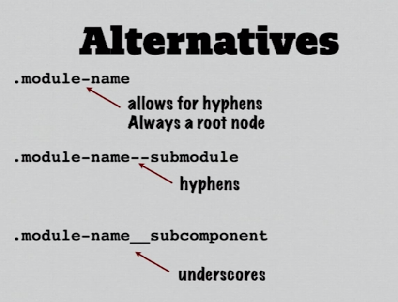

Learning CSS
==================

The document contains several notes and snippets from interviews to online sources I found helpful. They are in no particular order ether.

These are my personal notes on the subject and I apologize ahead of time if I didn't give credit or sources.

### Facts

- Cascading Style Sheets is a style sheet language developed to control the presentation of markup language documents.

HTML controls the structure of the web. While CSS controls the presentation of the HTML.

- Style sheets are a collection of formatting rules.
- Styles are most commonly contained in external files.
- Styles are applied to pages in the order they are found, cascading down from external to local styles.


### Animation

[Article](https://www.w3schools.com/css/css3_animations.asp)

**The @keyframes Rule**

When you specify CSS styles inside the @keyframes rule, the animation will gradually change from the current style to the new style at certain times.

To get an animation to work, you must bind the animation to an element.

```
/* The animation code */
@keyframes example {
    from {background-color: red;}
    to {background-color: yellow;}
}

/* The element to apply the animation to */
div {
    width: 100px;
    height: 100px;
    background-color: red;
    animation-name: example;
    animation-duration: 4s;
}

```

```
/* The animation code */
@keyframes example {
    0%   {background-color: red;}
    25%  {background-color: yellow;}
    50%  {background-color: blue;}
    100% {background-color: green;}
}

/* The element to apply the animation to */
div {
    width: 100px;
    height: 100px;
    background-color: red;
    animation-name: example;
    animation-duration: 4s;
}

```


### Responsive Layout

**Breakpoint**

[Correct Way](https://medium.freecodecamp.org/the-100-correct-way-to-do-css-breakpoints-88d6a5ba1862)

The point at which a website responds to provide the optimal layout for content in a specific view.

Breakpoints vary depending on the screen size of the device as well as the display resolution, but a general guide is:

```css

@mixin for-phone-only {
  @media (max-width: 599px) { @content; }
}
@mixin for-tablet-portrait-up {
  @media (min-width: 600px) { @content; }
}
@mixin for-tablet-landscape-up {
  @media (min-width: 900px) { @content; }
}
@mixin for-desktop-up {
  @media (min-width: 1200px) { @content; }
}
@mixin for-big-desktop-up {
  @media (min-width: 1800px) { @content; }
}

// usage
.my-box {
  padding: 10px;

  @include for-desktop-up {
    padding: 20px;
  }
}

```

```css

@mixin for-size($size) {
  @if $size == phone-only {
    @media (max-width: 599px) { @content; }
  } @else if $size == tablet-portrait-up {
    @media (min-width: 600px) { @content; }
  } @else if $size == tablet-landscape-up {
    @media (min-width: 900px) { @content; }
  } @else if $size == desktop-up {
    @media (min-width: 1200px) { @content; }
  } @else if $size == big-desktop-up {
    @media (min-width: 1800px) { @content; }
  }
}

// usage
.my-box {
  padding: 10px;

  @include for-size(desktop-up) {
    padding: 20px;
  }
}

```

```css
@mixin for-size($range) {
  $phone-upper-boundary: 600px;
  $tablet-portrait-upper-boundary: 900px;
  $tablet-landscape-upper-boundary: 1200px;
  $desktop-upper-boundary: 1800px;

  @if $range == phone-only {
    @media (max-width: #{$phone-upper-boundary - 1}) { @content; }
  } @else if $range == tablet-portrait-up {
    @media (min-width: $phone-upper-boundary) { @content; }
  } @else if $range == tablet-landscape-up {
    @media (min-width: $tablet-portrait-upper-boundary) { @content; }
  } @else if $range == desktop-up {
    @media (min-width: $tablet-landscape-upper-boundary) { @content; }
  } @else if $range == big-desktop-up {
    @media (min-width: $desktop-upper-boundary) { @content; }
  }
}

// usage
.my-box {
  padding: 10px;

  @include for-size(desktop-up) {
    padding: 20px;
  }
}

```


### SVG

Coming soon...

### Benefits of User Control

- Giving the user control enhances accessibility
- It prevents rendering issues from restricting access to content
- Users with disabilities can override smaller text sizes
- On the web, being able to access content matters.

### LEARNING CSS SYNTAX

- Focus on basic elements of CSS syntax first
- Explore the CSS specifications.
- Read through CSS from other sites.

### AUTHORING CONSIDERATIONS

- Most projects will rely heavily on external styles
- Embedded styles are mainly used to overwrite external styles
- You should plan on overall site strategy for style placement


### Box Model

All HTML elements can be considered as boxes. In CSS, the term "box model" is used when talking about design and layout.

The CSS box model is essentially a box that wraps around every HTML element. It consists of: margins, borders, padding, and the actual content. The image below illustrates the box model:


The Box Model refers to the physical propertied of an element’s rectangular box. These are margins, borders, padding, and content width and height.


TOTAL WIDTH OF AN ELEMENT of Box Model
{left border + left padding + content width + right padding + right border = total width}

**MARGINS**

- Margins represent the space between elements
- Margin values are not calculated as part of an elements total width
- Most elements have a default margin that you must account for

**BOX MODEL CONSIDERATIONS**

- If a property is not declared, don’t assume the value is 0
- Elements often have default margins that you need to account for
- A 100% width property when combined with padding & borders will create elements that are larger then their parents

**OUTLINES**

- Outlines have been part of CSS since the 2.0 specification
- Can only be set on the entire element, not individual sides.
- Does not effect the total element width
- Poor overall support, especially older browsers


### Usage:

```html
<link href=“stylesheet.css” type=“text/css” rel=“stylesheet” />

```

### Positioning

**absolute** positioning is when an element is set to position: absolute, it's then positioned in relation to the first parent element it has that doesn't have position: static. If there's no such element, the element with position: absolute gets positioned relative to <html>.

**Relative** positioning is more straightforward: it tells the element to move relative to where it would have landed if it just had the default static positioning. If you give an element relative positioning and tell it to have a margin-top of 10px, it doesn't move down ten pixels from any particular thing—it moves down ten pixels from where it otherwise would have been.

**fixed** positioning anchors an element to the browser window—you can think of it as gluing the element to the screen. If you scroll up and down, the fixed element stays put even as other elements scroll past

### CSS Rule

**Selector** = specifies which HTML elements to style. Inside the braces {}, a property and it’s value define what aspect of the elements to style
together, a selector and its property-value pairs are called a CSS rule

**Class Selector** - Classes are useful to specifically target groups of HTML elements. .class

### Hexadecimal values

Decimal values 0 through 9. Because there are ten possibilities, we say the regular counting in
is base-10.

Hexadecimal counting is base-16. Each digit can be the numbers 0 through 9 or
the letters a through f!

Hex values always start with a pound sign (#), are up to six "digits" long, and are case-insensitive: that is, they don't care about capitalization.#FFC125 and #ffc125 are the same color.

### Direct Children

If you want to grab direct children—that is, an element that is directly nested inside another element, with no elements in between—you can use the > symbol, like so:

```css
div > p { /* Some CSS */ }

```

### Specificity

Certain selectors will "override" others if they have a greater specificity value. ul li p { is more specific CSS than just p {, so when CSS sees tags that are both <p> tags and happen to be inside unordered lists, it will apply the more specific styling (ul li p {) to the text inside the lists.

### pseudo-class selector

A pseudo-class selector is a way of accessing HTML items that aren't part of the document tree (remember the tree structure we talked about earlier?). For instance, it's very easy to see where a link is in the tree. But where would you find information about whether a link had been clicked on or not? It isn't there!

Pseudo-class selectors let us style these kinds of changes in our HTML document. For example, we saw we could change a link's text-decoration property to make it something other than blue and underlined. Using pseudo selectors, you can control the appearance of unvisited and visited links—even links the user is hovering over but hasn't clicked!

The CSS syntax for pseudo selectors is

```css
selector:pseudo-class_selector {
    property: value;
}

```

### Nth child

You can actually select any child of an element after the first child with the pseudo-class selector nth-child; you just add the child's number in parentheses after the pseudo-class selector. For example:

```css
p:nth-child(2) {
    color: red;
}

```

Would turn every paragraph that is thesecond child of its parent element red.
The element that is the child goes before:nth-child; its parent element is the element that contains it.

### Flexbox

flexible boxes, or flexbox, is a new layout mode in CSS3.

Use of flexbox ensures that elements behave predictably when the page layout must accommodate different screen sizes and different display devices.

For many applications, the flexible box model provides an improvement over the block model in that it does not use floats, nor do the flex container's margins collapse with the margins of its contents.

[Guide](https://css-tricks.com/snippets/css/a-guide-to-flexbox/)

### Grid

CSS Grid Layout is the most powerful layout system available in CSS. It is a 2-dimensional system, meaning it can handle both columns and rows, unlike flexbox which is largely a 1-dimensional system

[Guide](https://css-tricks.com/snippets/css/complete-guide-grid/)

### Em vs. Rem

[Original Article](http://webdesign.tutsplus.com/tutorials/comprehensive-guide-when-to-use-em-vs-rem--cms-23984)

How rem Units Translate to Pixel Values

That root font size is multiplied by whatever number you’re using with your rem unit.
For example, with a root element font size of 16px, 10rem would equate to 160px, i.e. 10 x 16 = 160.

### How em Units Translate to Pixel Values

When using em units, the pixel value you end up with is a multiplication of the font size on the element being styled.
For example, if a div has a font size of 18px, 10em would equate to 180px, i.e. 10 x 18 = 180.

**Important to Know:**

It’s a somewhat widespread misconception that em units are relative to the font size of the parent element. In fact, as per the W3 spec, they are relative to the font size “of the element on which they are used”.

Parent element font sizes can effect em values, but when that happens it’s solely because of inheritance.

**Important to Know:**

The root html element inherits its font size from the settings in the browser, unless overridden with an explicitly set fixed value.

### Summarizing em vs. rem Difference

What all the above boils down to is this:

- Translation of rem units to pixel value is determined by the font size of the html element. This font size is influenced by inheritance from the browser font size setting unless explicitly overridden with a unit not subject to inheritance.


- Translation of em units to pixel values is determined by the font size of the element they’re used on. This font size is influenced by inheritance from parent elements unless explicitly overridden with a unit not subject to inheritance.


### SELECTORS

**selector** - tells the browser which element/elements to style

**declaration** - gives the formatting instructions for the style. Made of of two parts properties and values.

### GLOBAL SELECTORS

Global selectors based on individual HTML elements

```css
p { font-family: Arial, Helvetica, sans-serif; }
body { font-family: Arial, Helvetica, sans-serif; }
h1 { font-family: Arial, Helvetica, sans-serif; }

```
### CLASS SELECTORS

Attribute selector based on class attributes applied to HTML elements

```
<h2 class=“subheading”>Item two</h2>

.subheading { color:blue; }

```

### ID SELECTORS (must be unique to the page)

Attribute selector based on ID attributes applied to HTML elements

```
<div id=“sidebar”>…content</div>

#sidebar { font-sized:80%; }

```

### ELEMENT-SPECIFIC SELECTORS

Modified class or ID selector which limits application to a specific element

```css
h2.subheading {color:blue;}
div#sidebar { font-size:80%; }

```

### DESCENDENT SELECTORS

Highly specific selectors that target  elements based on their location within other elements.

```css
div p span { color: blue; }

```

No more then 3 deep is best practice.
Descendent selectors applies style to any nested element no matter how deep its found within the page structure.

### GROUPING SELECTORS

Allows you to group selectors together that share formatting.

```css
h1, h2, .quote {font-weight: normal; color: blue; }

```

### HOW BROWSERS READ SELECTORS

```css
 #mainContent div p span { color: blue; }

```
- Browsers read the selector from right to left. So the browser would find all the span tags in the page first.

- Then check to see if they were inside a paragraph tag.

- Then it would scan through the page to see if the paragraph tags are within a div tag.

- Then finally it would scan the remaining page to see if any of the elements are within a id of mainContent.

### USE MEANINGFUL CLASSES AND IDS

- Classes and IDs should be descriptive and should add additional meaning to your markup.

### GUIDELINES FOR WRITING HTML

- Focus on writing clean, efficient code.
- Structure the HTML so that it adds meaning to the content.
- Don’t focus on styling when initial structuring code.
- Well-structured code is much easier to style.

### CLASS & ID NAMING CONVENTIONS

- No whitespace or special characters
- CSS is case-sensitive
- Establish standards for your CSS and stay consistent with them.

### STYLE LOCATION

- External Styles
    - external style sheets is a text file with a .css extension
    - <link href=“main.css” rel=“stylesheet” type=“text” media=“screen, projection">
- Embedded Styles
    - Only apply styles to the document they are found in.
    -  <style> h1 { color: blue; } </style>
- Inline Styles
    - CSS styles added to an element via a HTML attribute.
    - <p style=“color: blue;"> ..content </p>
    - inefficient and very hard to overwrite and maintain.
    - OK, in html emails were older email clients offer weaker CSS support.

### THE CASCADE

- External styles are applied first
- Second Followed by embedded styles
- Then lastly inline styles are applied if they are within the document.

If any style conflict with each other, the most recent set of styles will override the earlier styles.

THE LAST RULE APPLIED WINS!! (meaning the last selector wins)

Styles are applied in the order that they are found.

### INHERITANCE

- Child elements will inherit the properties applied of their parents.
- Child rules will always override their parent rules if there is a conflict.

Example:
```css
 body { color: red }

```

Instead of:

```css
h1 {color: red}
h2 {color: red}
h3 {color: red}

```

### SPECIFICITY

Is a fancy way to say how specific a rule is.

If the cascade or inheritance can resolve a conflict, the more specific rule wins.

Each rule has a weight score that makes up the selector.

### STYLES ARE CUMULATIVE

Styles are cumulative, that is the final rendering of elements depends not only on selectors that directly target the element, but also on any properties that might be inherited from earlier styles or parent elements.

### THE RISE OF WEB STANDARDS

Standards compliant browsers allow you to write clean, valid CSS in the assurance that pages will render consistently across multiple browsers.

### EARLY CSS SUPPORT

- Early browsers did not focus on interoperability or standards
- Many had proprietary features and elements
- CSS specifications weren’t as formal as they are now
- No browser every fully implemented CSS 2.0
- Modern browsers implement full support of the CSS 2.1 standard for the most part

### CHALLENGES FOR WRITING SPECIFICATIONS

- W3C process makes it hard to get large documents published quickly
- The pace of the web means that many specs are outdated when published.
- Online application development and the mobile web have introduced new needs in CSS

### MODULARIZATION OF CSS

- CSS3 is not a single specification
- CSS is now published as a series of modularized specifications
- Sections like Selectors are now in their own specifications
- This approach gives the W3C the ability to prioritize spec and react rapidly to new needs

### TRACKING BROWSER SUPPORT

- Nothing beats testing in multiple browsers
- if possible, test Safari, Chrome, Firefox, Opera, and Internet Explorer
- Earlier browser version support often differs from current versions
- Increasingly, authors need to test on mobile devices

### CHECKING CROSS-BROWSER SUPPORT

- http://caniuse.com/#cats=CSS
- http://www.quirksmode.org/compatibility.html
- http://en.wikipedia.org/wiki/Comparison_of_layout_engines_(Cascading_Style_Sheets)
- http://positioniseverything.net/ (good legacy IE)
- https://developer.mozilla.org/en-US/docs/Web/CSS/Mozilla_support_chart (FireFox)
- https://developer.apple.com/library/safari/documentation/AppleApplications/Reference/SafariCSSRef/Articles/StandardCSSProperties.html (safari)
- http://www.opera.com/docs/specs/ (opera)
- http://msdn.microsoft.com/en-us/library/hh781508%28v=vs.85%29.aspx (IE)

### hasLayout FIX IE
- http://www.sitepoint.com/web-foundations/internet-explorer-haslayout-property/ (hasLayout Property)
- A hasLayout fix involves nothing more than declaring a CSS property that causes an element to gain a layout, when it wouldn’t ordinarily have a layout by default.
The simplest way for an element to gain a layout is for it to have a dimensional CSS property applied—for example, awidth or height. However, in situations where you don’t wish to apply a specific width or height to the element, there are several other CSS properties that, when you apply them to the element, will cause that element to gain a layout.
Those other properties are:
    - display: inline-block
    - height: (any value except auto)
    - float: (left or right)
    - position: absolute
    - width: (any value except auto)
    - writing-mode: tb-rl
    - zoom: (any value except normal)
- Internet Explorer 7 has some additional properties that cause an element to gain a layout (this is not an exhaustive list):
    - min-height: (any value)
    - max-height: (any value except none)
    - min-width: (any value)
    - max-width: (any value except none)
    - overflow: (any value except visible)
    - overflow-x: (any value except visible)
    - overflow-y: (any value except visible)5
    - position: fixed

### PURPOSE OF SPECIFICATIONS

- Specifications are written for implementers
- Specs will often contain detailed parsing information, error handling, and syntax rules
- This complexity can often confuse authors


### THE FUTURE OF CSS

- To learn more about the planning behind CSS3 read the W3C road map at http://www.w3.org/TR/CSS/#css3
- All future CSS work will update existing modules or add new ones.


### SMACSS




Questions
===================

**Can you build a Sass mixing?**

* Functions
* Take arguments
* Initialized with defaults

```css

@mixin bgcolor ($color) {
  background-color: $color;
}

```


**Do you know how to use CSS variables?**

* Use today with PostCSS
* Create in :root
* Define --yellow, @custom
* Use with var(--yellow), @apply

```css

:root {
 --green: green;
 --red: red;

 --btn {
   color: var(--red);
   display: block;
 }

 @custom-media --min (width <= 600px);
 @custom-media --max (width > 600px);
 @custom-selector :--headings h1, h2, h3, h4, h5, h6;
}

:--headings {
  color: var(--red);
  margin-top: 0;
  margin-bottom: 1rem;
}

body {
  background-color: var(--green);
}

.nav .btn.hamburger {
  @apply --btn;
  margin: 10px auto;

}

@media (--min) {
  body {
    background-color: var(--red);
  }
}

```

**Animate an underline on hover in CSS**

```css

.nav-link {
  position: relative;
}

.nav-link:before {
  content: "";
  position: absolute;
  width: 100%;
  max-width: 100px;
  height: 2px;
  bottom: 8px;
  left: -50%;
  background-color: rgba(255, 255, 255, 1);
  opacity: 0;
  transform: scaleX(0);
  transition: all .3 ease-in-out 0s;
}

.nav-link:hover:before {
  opacity: 1;
  left: 0;
  transform: scaleX(1);
}

```

**Explain the difference between absolute and relative positioning?**

Relative is within the document flow, and absolute position is removed from the document flow.

Postion Property
* static, relative, absolute, fixed
* Adjustable (top right bottom left)
* Remove from the flow
* Relative to what?


Fixed is always going to be relative to the entire document, absolute can either be set to the position of the parent element or the entire document.

**How comfortable are you with Sass?**

Sass
* .scss vs .sass
* Ruby vs NodeSass
* Variables. nesting, partials, mixins

**How do you animate CSS?**
 
 It involves creating a keyframe-based sequence of changes, and then applying it to a CSS rule.
 
 * @keyframes
 * animation-name, animation-duration, animation-timing-function, animation-delay, animation-iteration-count, animation-directions, animation-fill-mode, animation-play-state
 * animation combo

 ```css
 @keyframes animSeq {
   0% { opacity: 1 }
   100% { opacity: 0 }
 }

 .myAnimation {
   animation-name: animSeq;
   animation-duration: .5s;
   animation-timing-function: ease-out;
   animation-delay: 0;
 }
 ```


**How do you debug CSS using your browser?**
Use Chrome developer tools

**How do you use calc() in CSS?**

Calc is a feature that lets you perform mathematical calculations right in your CSS. It can be really useful when writing layout code, because it can make things a lot clearer.

 ```css

.container {
  width: 90%;
  max-width: calc(900px - 10%);
  margin: 0 auto;
}

 ```

**How would you use flex box to control horizontal alignment?**

Horizontal Alignment
* display: flex;
* flex-direction: (row, column, row-reverse, column-reverse )
* flex-wrap: (nowrap, wrap, wrap-reverse)
* justify-content (flex-start, flex-end, center, space-between, space-around)


**In CSS, what’s the difference between Ems and rems?**

Rems = Relative to the root font size;

Ems = Relative to the font-size of the element (2em means 2 times the size of the current font)


**Whats’ the difference between a pseudo class and a pseudo element?**

Pseudo Classes
* Select an element
* State or Property
* Single colon : (:hover, :focus, :first-child, :nth-child, :not)

 ```css

.container a:hover{
 color: red;
}

 ```

Pseudo Elements
* Virtual elements ( select something that's not a element)
* One or two colons? (::before, ::after, ::first-letter)

 ```css

.container p::first-letter{
 color: red;
}

 ```

Glossary
==================

**block**: This makes the element a block box. It won't let anything sit next to it on the page! It takes up the full width.

**browser default styles** when there is no style applied to the page.

**inline-block**: This makes the element a block box, but will allow other elements to sit next to it on the same line.

**inline**: This makes the element sit on the same line as another element, but without formatting it like a block. It only takes up as much width as it needs (not the whole line).

**px** is a dot on your computer screen. Specifying font sizes in pixels is great when you want the user to see exactly on their screen what you designed on yours, though it assumes your screens are similar size.

**em** is a relative measure; one em is equal to the default font size on whatever screen the user is using. This makes it great for smartphone screens, since it doesn’t try to tell the smartphone exactly how big to make a font: it says, “Hey, 1em is the font size that you normally

**ex** is relative to the x-height of the current font (rarely used)

**vh** is relative to 1% of the height of the viewport*

**ch** is relative to width of the "0" (zero)

**vw** is relative to 1% of the width of the viewport*

**vmin** is relative to 1% of viewport's* smaller dimension

**vmax** is relative to 1% of viewport's* larger dimension

**rem** is relative to font-size of the root element

**Grid** Layout is a new layout model for CSS that has powerful abilities to control the sizing and positioning of boxes and their contents. Unlike Flexible Box Layout, which is single-axis–oriented, Grid Layout is optimized for 2-dimensional layouts: those in which alignment of content is desired in both dimensions.

**none**: This makes the element and its content disappear from the page entirely!

**margin** is a transparent area outside the border of an element.
border is the edge of the element. It's what we've been making visible every time we set the border property.

**padding** is the spacing between the content and border of an element. This whitespace is useful in order to improve readability and organization of the page

**content** is the actual "stuff" in the box. If we're talking about a <p> element, the "stuff" is the text of the paragraph.
You'll see abbreviations like TM, TB, and TPin the diagram. These stand for "top margin," "top border," and "top padding." As we'll see, we can adjust the top, right, left, and bottom padding, border, and margin individually.


Learning C++
=====================

Find the greatest common denominator of two numbers using Euclid's algorithm:

```cpp
#include <iostream>

// Find the greatest common denominator of two numbers
// using Euclid's algorithm

int gcd (int a, int b)
{
    while (b != 0)
    {
        int t = a;
        a = b;
        b = t % b;
    };

    return a;
}

int main( int argc, char ** argv )
{
    std::cout << gcd(60, 96) << std::endl; // should be 12
    std::cout << gcd(20, 8) << std::endl; // should be 4
    return 0;
}

```
## Recursion

```cpp
#include <iostream>
/////////////////
// recursion
/////////////////

// 2^4 = 2x2x2x2 = 16
int power(int num, int pwr)
{
    if (pwr == 0)
    {
        return 1;
    }
    else
    {
        return num * power(num, pwr - 1);
    }
}

// 5! = 5x4x3x2x1 = 120
int factorial(int num)
{
   if (num == 0)
   {
       return 1;
   }
   else
   {
       return num * factorial(num -1);
   }
}

int main( int argc, char ** argv )
{
    std::cout << power(2, 4) << std::endl; // should be 16
    std::cout << factorial(5) << std::endl; // should be 120
    return 0;
}
```
## Bubble Sort
* Very simple to understand and implement 
* Performance: O(n^2)
    * For loops inside of for loops are usually n^2
* Other sorting algorithms are generally much better
* Not considered to be a practical solution

```cpp
#include <iostream>
// BubbleSort
void swap(int *xp, int *yp)
{
    int temp = *xp;
    *xp = *yp;
    *yp = temp;
}

// A function to implement bubble sort
void bubbleSort(int arr[], int n)
{
    int i, j;
    for (i = 0; i < n-1; i++)
        
        // Last i elements are already in place
        for (j = 0; j < n-i-1; j++)
            if (arr[j] > arr[j+1])
                swap(&arr[j], &arr[j+1]);
}

int main( int argc, char ** argv )
{
    int numbers [] = {5,10,1,6,2,9,3,8,7,4};
    int n = sizeof(numbers)/sizeof(numbers[0]);
    bubbleSort(numbers, n);
    for( int i = 0; i < n; ++i)
    {
        std::cout << numbers[i] << " ";
    }
    std::cout << "\n";
    return 0;
}
```
## Merge Sort
* Divide-and-conquer algorithm
* Breaks a dataset into individual pieces and manages them
* Uses recursion to operate on datasets
* Performs well on large sets of data
* In general has a performance of O(n log n) time complexity

Split the array into halves and merge them recursively
```cpp
// Split the array into halves and merge them recursively
void merge(int *arr, int size, int first, int middle, int last)
{
    int temp[size];
    for(int i = first; i<=last; i++)
    {
        temp[i] = arr[i];
    }
    int i = first, j = middle + 1, k = first;
    while(i <= middle && j <= last)
    {
        if(temp[i] <= temp[j])
        {
            arr[k] = temp[i];
            i++;
        }
        else
        {
            arr[k]=temp[j];
            j++;
        }
        k++;
    }
    while (i <= middle)
    {
        arr[k]=temp[i];
        k++;
        i++;
    }
}

void mergesort(int *arr, int size, int first, int last)
{
    if (first<last)
    {
        int middle = ( first + last )/2;
        mergesort(arr,size,first,middle);
        mergesort(arr,size,middle+1,last);
        merge(arr,size,first,middle,last);
    }
}

int main( int argc, char ** argv )
{
    const int size = 10;
    int numbers [] = {5,10,1,6,2,9,3,8,7,4};
    mergesort(numbers, size, 0, 9);
    for( int i = 0; i < size; ++i)
    {
        std::cout << numbers[i] << " ";
    }
    std::cout << "\n";
    return 0;
}
```

### Quick Sort
* Divide-and-conquer algorithm, like the merge sort
* Also uses recursion to perform sorting
* Generally performs better then merge sort, O(n log n)
* Operates in place on the data
* Worst case O(n2) when data is mostly sorted already

Quicksort is a fast sorting algorithm, which is used not only for educational purposes, but widely applied in practice. On the average, it has O(n log n) complexity, making quicksort suitable for sorting big data volumes. 

```cpp
#include <iostream>
// quickSort
void quickSort(int arr[], int left, int right)
{
    int i = left, j = right;
    int tmp;
    int pivot = arr[(left + right) / 2];

    /* partition */
    while (i <= j)
    {
        while (arr[i] < pivot)
            i++;
        
        while (arr[j] > pivot)
            j--;
        
        if (i <= j)
        {
            tmp = arr[i];
            arr[i] = arr[j];
            arr[j] = tmp;
            i++;
            j--;
        }
    };
    
    /* recursion */
    if (left < j)
        quickSort(arr, left, j);
    
    if (i < right)
        quickSort(arr, i, right);
}

int main( int argc, char ** argv )
{
    const int size = 10;
    int numbers [] = {5,10,1,6,2,9,3,8,7,4};
    quickSort(numbers, 0, 9);
    for( int i = 0; i < size; ++i)
    {
        std::cout << numbers[i] << " ";
    }
    std::cout << "\n";
    return 0;
}

```
### Unordered List Search

```cpp
#include <iostream>

// Unordered list search
void find_item(int item, int itemList[])
{
    int i;
    int length = sizeof(itemList);
    
    for (i = 0; i < length; ++i)
    {
        if (item == itemList[i])
        {
            std::cout << item << std::endl;
        }
    }
}

int main( int argc, char ** argv )
{
    int numbers [] = {5,10,1,6,2,9,3,8,7,4};
    find_item(10, numbers);
    std::cout << "\n";
    return 0;
}
```
### Ordered list search

```cpp
#include <iostream>

// Ordered list search
int binarySearch(int item, int itemList[], int listsize)
{
    // start at the two ends of the list
    int left = 0;
    int right = listsize;
    
    while (left <= right) {
        // calc the middle point
        int midPt = ((left + right) / 2);
        
        // if the item is found, return the index
        if (itemList[midPt] == item)
        {
            return itemList[midPt];
        }
        // otherwise get the next midpoint
        else if (item > itemList[midPt])
        {
            //std::cout << itemList[midPt] << std::endl;
            left = midPt + 1;
        }
        else
        {
            right = midPt - 1;
        }
    }
    // not in the list
    return -1;
}

int main( int argc, char ** argv )
{
    int numbers [] = {6, 12, 14, 15, 18, 20, 22, 25}; // must be a ordered list
    int size = sizeof(numbers) / sizeof(*numbers);
    int result = binarySearch(15, numbers, size);
    std::cout << result << "\n";
    return 0;
}

```

## Determine if list is sorted
```cpp
#include <iostream>

// determine if a list is sorted
bool isSorted (int itemList[], int size)
{
    // use the brut force method
    int i;
    for (i = 0; i < size; i++) {
        std::cout << itemList[i] << "\n";
        if (itemList[i] > itemList[i+1])
        {
            std::cout << "False" << "\n";
            return false;
        }
        else
        {
            std::cout << "True" << "\n";
            return true;
        }
    }
    return false;
}


int main( int argc, char ** argv )
{
    int sorted [] = {6, 8, 14, 15, 18, 20, 22, 25};
    int unsorted [] = { 12, 6, 22, 30, 1, 15, 33, 2};
    
    int size = sizeof(sorted) / sizeof(*sorted);
    int result = isSorted(sorted, size);
    std::cout << result << "\n";
    return 0;
}

```

### Unique Filtering With Hash Table

```cpp
#include <iostream>
#include <string>
#include <map>

int main( int argc, char ** argv )
{
    // define a set of items that we want to reduce duplicates
    std::string items [] = {"apple", "pear", "orange", "banana", "apple", "orange", "apple", "pear", "banana", "orange", "apple", "kiwi", "pear", "orange"};
    
    // create a hash table to perform a filter
    std::map<std::string, int> filter;
    
    // loop over each item and add to hash table
    int i = 0;
    for (auto item : items)
    {
        ++i;
        filter.insert(std::pair<std::string, int>(item, i));
    }
    
    // create a set from the resulting keys in the hashtable
    for (std::pair<std::string, int> element : filter) {
        // Accessing KEY from element
        std::string word = element.first;
        std::cout << word << std::endl;
    }
    return 0;
}
```

### Find max value recursively
```cpp
#include <iostream>


// function to print Max element using recursion
int findMaxRec(int A[], int n)
{
    // if size = 0 means whole array has been traversed
    if (n == 1)
        return A[0];
    return std::max(A[n-1], findMaxRec(A, n-1));
}

int main( int argc, char ** argv )
{
    int A[] = {1, 4, 45, 6, -60, 10, 2};
    int n = sizeof(A)/sizeof(A[0]);
    std::cout <<  findMaxRec(A, n) << std::endl;
    return 0;
}


```

